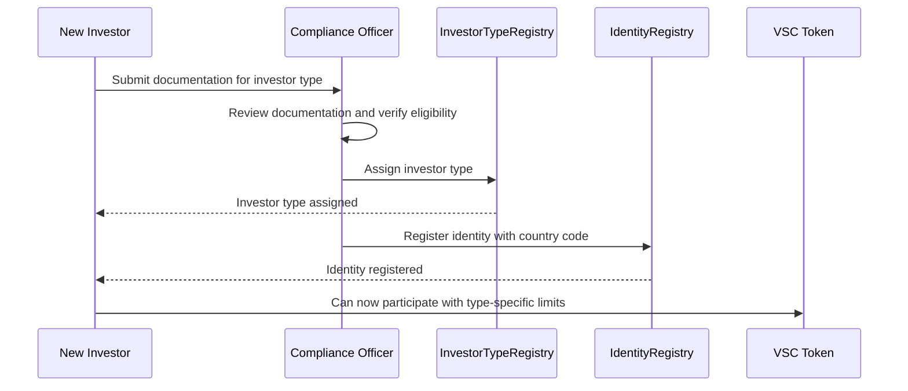
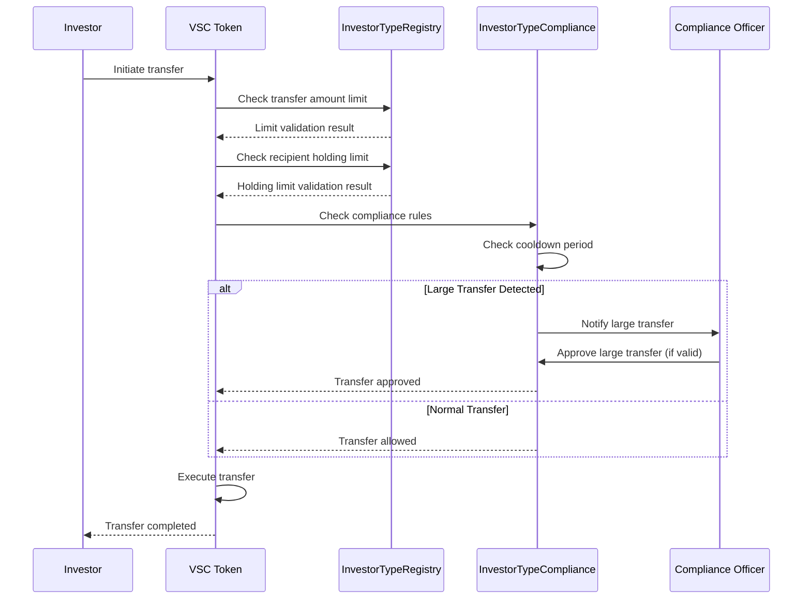
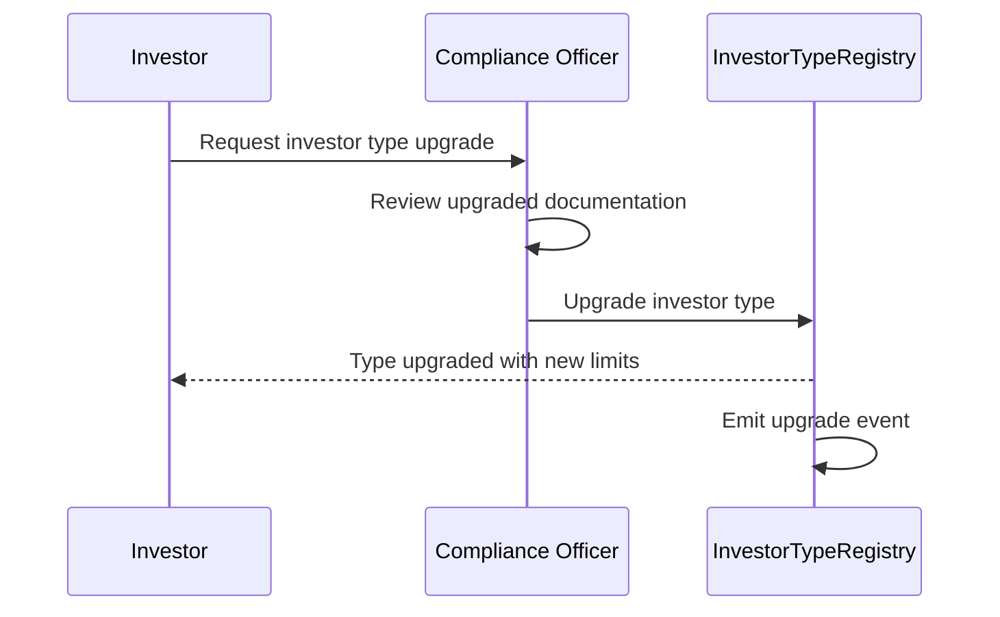

# Investor Type System Documentation

## Overview

The Investor Type System is a comprehensive framework that implements differentiated investor categories with appropriate transfer limits, holding limits, and privileges for the Vanguard StableCoin ecosystem. This system ensures regulatory compliance while providing enhanced features for qualified investors.

## Architecture

### Core Components

1. **InvestorTypeRegistry** - Central registry for managing investor types and configurations
2. **InvestorTypeCompliance** - Compliance module that enforces investor type rules
3. **Enhanced IdentityRegistry** - Integration with existing identity management
4. **Enhanced Token Contract** - Integration with ERC-3643 token transfers

### Investor Type Categories

| Type | Max Transfer | Max Holding | Whitelist Tier | Cooldown | Large Transfer Threshold | Enhanced Features |
|------|-------------|-------------|----------------|----------|-------------------------|-------------------|
| **Normal** | 8,000 VSC | 50,000 VSC | Tier 1+ | 1 hour | N/A | Basic logging, Standard privacy |
| **Retail** | 8,000 VSC | 50,000 VSC | Tier 2+ | 1 hour | N/A | Basic logging, Standard privacy |
| **Accredited** | 50,000 VSC | 500,000 VSC | Tier 3+ | 30 minutes | >10,000 VSC | Enhanced logging, Enhanced privacy |
| **Institutional** | 500,000 VSC | 5,000,000 VSC | Tier 4+ | 15 minutes | >100,000 VSC | Enhanced logging, Premium privacy |

## Smart Contracts

### InvestorTypeRegistry.sol

Central registry for managing investor types and their configurations.

#### Key Functions

```solidity
// Assign investor type (compliance officer only)
function assignInvestorType(address investor, InvestorType investorType) external;

// Upgrade investor type (compliance officer only)
function upgradeInvestorType(address investor, InvestorType newType) external;

// Downgrade investor type (compliance officer only)
function downgradeInvestorType(address investor, InvestorType newType) external;

// Get investor type for address
function getInvestorType(address investor) external view returns (InvestorType);

// Check transfer amount limits
function canTransferAmount(address investor, uint256 amount) external view returns (bool);

// Check holding amount limits
function canHoldAmount(address investor, uint256 amount) external view returns (bool);

// Check if transfer is considered "large"
function isLargeTransfer(address investor, uint256 amount) external view returns (bool);
```

#### Events

```solidity
event InvestorTypeAssigned(address indexed investor, InvestorType investorType, address indexed officer);
event InvestorTypeUpgraded(address indexed investor, InvestorType oldType, InvestorType newType, address indexed officer);
event InvestorTypeDowngraded(address indexed investor, InvestorType oldType, InvestorType newType, address indexed officer);
```

### InvestorTypeCompliance.sol

Compliance module that enforces investor type rules and manages large transfer approvals.

#### Key Functions

```solidity
// Check if transfer is allowed based on investor type rules
function canTransfer(address _from, address _to, uint256 _value) external view returns (bool);

// Approve large transfer (compliance officer only)
function approveLargeTransfer(address _from, address _to, uint256 _value, uint256 _expiryTime) external;

// Emergency override for compliance situations
function activateEmergencyOverride(address _investor) external;
function deactivateEmergencyOverride(address _investor) external;

// Get remaining transfer cooldown
function getRemainingCooldown(address _investor) external view returns (uint256);
```

#### Events

```solidity
event LargeTransferDetected(address indexed from, address indexed to, uint256 amount, InvestorType investorType);
event LargeTransferApproved(address indexed from, address indexed to, uint256 amount, address indexed officer);
event TransferCooldownViolation(address indexed investor, uint256 remainingCooldown);
event EmergencyOverrideActivated(address indexed investor, address indexed officer);
```

## Integration Points

### 1. Identity Registry Integration

The IdentityRegistry has been enhanced to work with the InvestorTypeRegistry:

```solidity
// Set investor type registry
function setInvestorTypeRegistry(address _investorTypeRegistry) external onlyOwner;

// Get investor type for user
function getInvestorType(address _userAddress) external view returns (InvestorType);

// Check transfer/holding limits
function canTransferAmount(address _userAddress, uint256 _amount) external view returns (bool);
function canHoldAmount(address _userAddress, uint256 _amount) external view returns (bool);
```

### 2. Token Contract Integration

The Token contract has been enhanced to enforce investor type limits:

```solidity
// Set investor type registry
function setInvestorTypeRegistry(address _investorTypeRegistryAddress) external onlyOwner;

// Enhanced canTransfer with investor type validation
function canTransfer(address _from, address _to, uint256 _amount) public view override returns (bool);
```

The enhanced `canTransfer` function now checks:
- Transfer amount limits based on sender's investor type
- Holding amount limits based on recipient's investor type
- Integration with existing compliance and identity validation

## Workflows

### 1. Investor Onboarding Workflow



### 2. Transfer Validation Workflow



### 3. Investor Type Upgrade Workflow



## Access Control

### Roles and Permissions

1. **Owner** (Contract Deployer)
   - Update investor type configurations
   - Set compliance officers
   - Authorize tokens to use the registry

2. **Compliance Officer**
   - Assign investor types
   - Upgrade/downgrade investor types
   - Approve large transfers
   - Activate/deactivate emergency overrides

3. **Authorized Tokens**
   - Query investor type information
   - Validate transfer and holding limits

### Security Features

1. **Multi-signature Support** - Critical operations can require multiple compliance officer approvals
2. **Emergency Override** - Compliance officers can temporarily bypass limits for emergency situations
3. **Time-based Approvals** - Large transfer approvals have expiry times
4. **Audit Trail** - All investor type changes and approvals are logged with events

## Configuration Management

### Default Configurations

The system comes with pre-configured limits that can be updated by the owner:

```solidity
struct InvestorTypeConfig {
    uint256 maxTransferAmount;      // Maximum transfer per transaction
    uint256 maxHoldingAmount;       // Maximum total holding
    uint8 requiredWhitelistTier;    // Minimum whitelist tier
    uint256 transferCooldownMinutes; // Cooldown between transfers
    uint256 largeTransferThreshold; // Threshold for large transfers
    bool enhancedLogging;           // Enhanced audit logging
    bool enhancedPrivacy;           // Enhanced privacy features
}
```

### Updating Configurations

Only the contract owner can update investor type configurations:

```solidity
function updateInvestorTypeConfig(
    InvestorType investorType,
    InvestorTypeConfig calldata config
) external onlyOwner;
```

## Compliance Features

### 1. Transfer Cooldowns

Each investor type has a specific cooldown period between transfers:
- **Normal/Retail**: 1 hour
- **Accredited**: 30 minutes  
- **Institutional**: 15 minutes

### 2. Large Transfer Notifications

Transfers above certain thresholds require compliance officer approval:
- **Accredited**: >10,000 VSC
- **Institutional**: >100,000 VSC

### 3. Emergency Overrides

Compliance officers can activate emergency overrides to bypass all limits temporarily for specific investors.

### 4. Enhanced Logging

Higher-tier investors (Accredited and Institutional) have enhanced audit logging enabled by default.

## Testing

### Test Coverage

The system includes comprehensive tests covering:

1. **Investor Type Assignment**
   - Compliance officer authorization
   - Type upgrade/downgrade workflows
   - Access control validation

2. **Transfer Limit Enforcement**
   - Amount limits by investor type
   - Holding limits by investor type
   - Integration with token transfers

3. **Large Transfer Management**
   - Detection of large transfers
   - Approval workflow
   - Expiry handling

4. **Cooldown Management**
   - Cooldown period enforcement
   - Remaining cooldown calculation
   - Integration with compliance checks

5. **Emergency Procedures**
   - Emergency override activation/deactivation
   - Override bypass validation

### Running Tests

```bash
# Run all investor type system tests
npx hardhat test test/InvestorTypeSystem.test.ts

# Run with coverage
npx hardhat coverage --testfiles "test/InvestorTypeSystem.test.ts"
```

## Deployment

### Deployment Script

Use the provided deployment script:

```bash
npx hardhat run scripts/deploy-investor-type-system.ts --network <network>
```

### Post-Deployment Setup

1. **Set Compliance Officers**
   ```solidity
   investorTypeRegistry.setComplianceOfficer(officerAddress, true);
   investorTypeCompliance.setComplianceOfficer(officerAddress, true);
   ```

2. **Integrate with Existing Contracts**
   ```solidity
   identityRegistry.setInvestorTypeRegistry(investorTypeRegistryAddress);
   token.setInvestorTypeRegistry(investorTypeRegistryAddress);
   ```

3. **Authorize Tokens**
   ```solidity
   investorTypeRegistry.authorizeToken(tokenAddress, true);
   ```

## Integration with Existing System

### Oracle Integration

The investor type system integrates with the existing oracle whitelist system by requiring specific whitelist tiers for each investor type:

- **Normal**: Tier 1+ (Basic whitelist)
- **Retail**: Tier 2+ (Standard whitelist)  
- **Accredited**: Tier 3+ (Enhanced whitelist)
- **Institutional**: Tier 4+ (Premium whitelist)

### Privacy Integration

The system supports different privacy levels:
- **Standard Privacy**: Normal and Retail investors
- **Enhanced Privacy**: Accredited investors
- **Premium Privacy**: Institutional investors

### Compliance Rules Integration

The InvestorTypeCompliance module works alongside the existing ComplianceRules engine to provide comprehensive compliance validation.

## Future Enhancements

### Planned Features

1. **Dynamic Limit Adjustment** - Automatic limit adjustments based on market conditions
2. **Risk-Based Scoring** - Integration with risk assessment systems
3. **Automated Upgrades** - Automatic investor type upgrades based on criteria
4. **Cross-Chain Support** - Multi-chain investor type synchronization
5. **Advanced Analytics** - Investor behavior analytics and reporting

### Extensibility

The system is designed to be extensible:
- New investor types can be added
- Additional compliance rules can be integrated
- Custom validation logic can be implemented
- Integration with external compliance systems

## Conclusion

The Investor Type System provides a robust, flexible framework for managing differentiated investor access to the Vanguard StableCoin ecosystem. It ensures regulatory compliance while enabling enhanced features for qualified investors, supporting the system's growth and adoption across different investor segments.