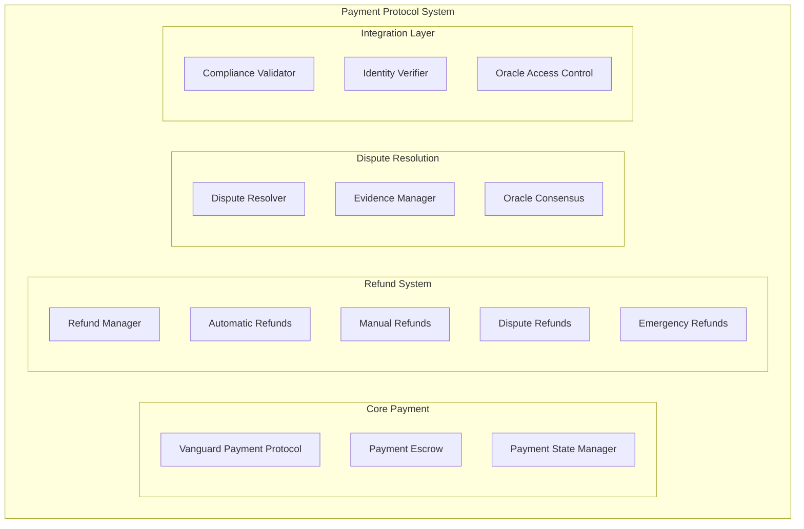
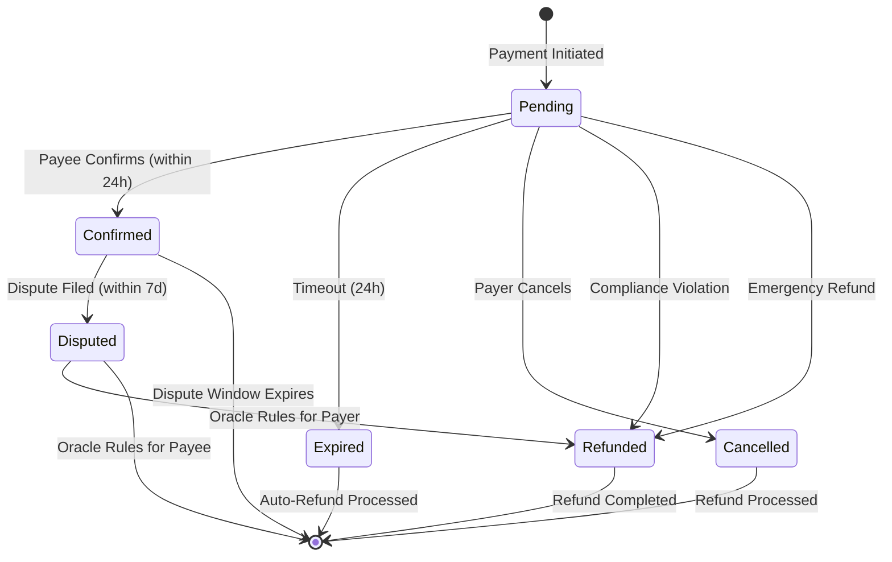
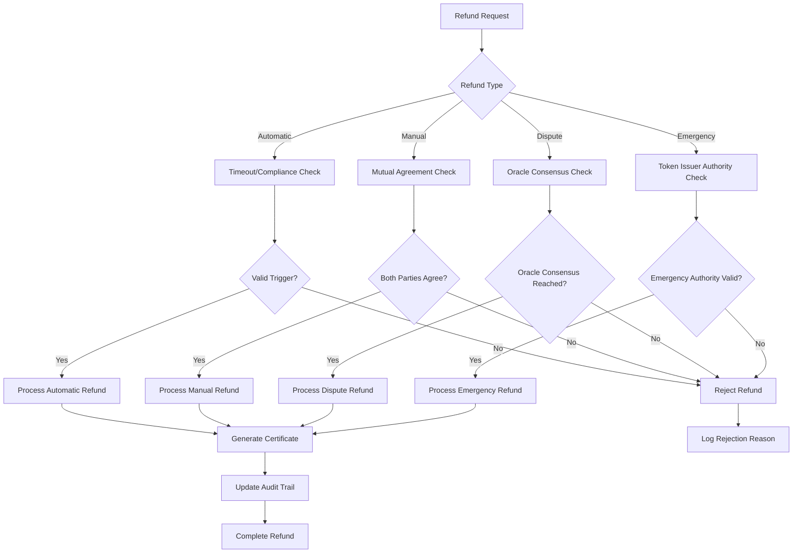
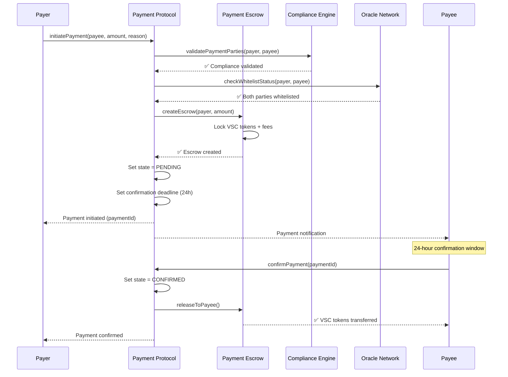
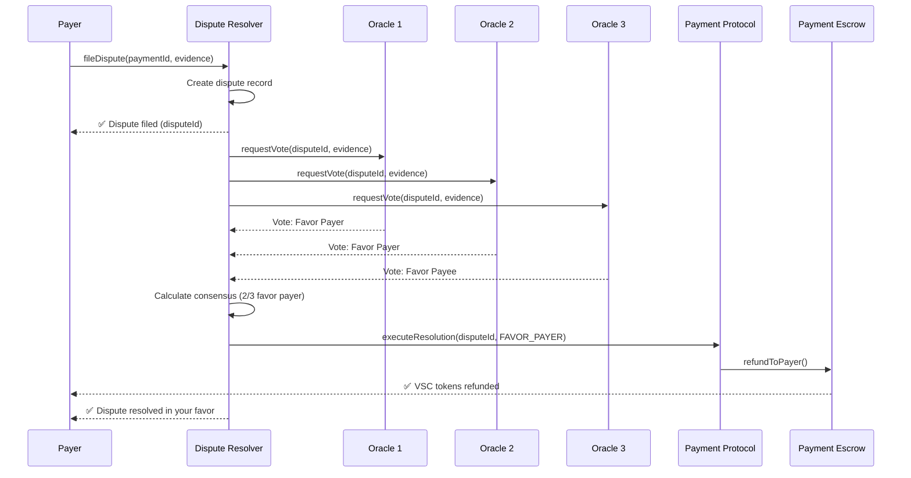

# Payment Protocol Design Document

## Overview

The Vanguard StableCoin Payment Protocol provides secure, escrow-based payments with comprehensive refund mechanisms. The system enables controlled transactions between parties with built-in dispute resolution, automatic refunds, and emergency controls while maintaining full regulatory compliance.

## Core Architecture

### Payment System Components



## Payment States and Lifecycle

### Payment State Machine



### Payment Configuration

```solidity
struct PaymentSettings {
    uint256 confirmationPeriod;    // 24 hours default
    uint256 disputeWindow;         // 7 days default
    uint256 refundWindow;          // 30 days default
    uint256 maxPaymentAmount;      // 50,000 VSC
    uint256 minPaymentAmount;      // 1 VSC
    uint16 escrowFeeRate;          // 0.1% (10 basis points)
}

struct Payment {
    bytes32 paymentId;
    address payer;
    address payee;
    uint256 amount;
    PaymentState state;
    uint256 createdAt;
    uint256 confirmedAt;
    uint256 disputeDeadline;
    bytes32 complianceHash;
    bool refundable;
    string paymentReason;
    uint256 escrowAmount;
}

enum PaymentState {
    PENDING,      // Payment initiated, funds in escrow
    CONFIRMED,    // Payment confirmed, funds released to payee
    DISPUTED,     // Payment disputed, awaiting resolution
    REFUNDED,     // Payment refunded, funds returned to payer
    EXPIRED,      // Payment expired, automatic refund triggered
    CANCELLED     // Payment cancelled before confirmation
}
```

## Smart Contract Architecture

### 1. VanguardPaymentProtocol.sol

**Primary Functions:**
- Payment initiation and management
- State transition control
- Compliance integration
- Event emission and logging

**Key Methods:**
```solidity
function initiatePayment(
    address payee,
    uint256 amount,
    string calldata reason
) external returns (bytes32 paymentId);

function confirmPayment(bytes32 paymentId) external;
function cancelPayment(bytes32 paymentId) external;
function getPayment(bytes32 paymentId) external view returns (Payment memory);
function getPaymentsByUser(address user) external view returns (bytes32[] memory);
```

### 2. PaymentEscrow.sol

**Primary Functions:**
- Secure fund holding during payment processing
- Automated fund release based on conditions
- Fee collection and management
- Emergency fund recovery

**Key Methods:**
```solidity
function createEscrow(
    bytes32 paymentId,
    address payer,
    address payee,
    uint256 amount
) external returns (address escrowAddress);

function releaseToPayee(bytes32 paymentId) external;
function refundToPayer(bytes32 paymentId) external;
function partialRelease(bytes32 paymentId, uint256 payerAmount, uint256 payeeAmount) external;
```

### 3. RefundManager.sol

**Primary Functions:**
- Multi-type refund processing
- Refund authorization validation
- Certificate generation
- Audit trail maintenance

**Key Methods:**
```solidity
function processRefund(
    bytes32 paymentId,
    RefundType refundType,
    string calldata reason,
    address authorizedBy
) external returns (bytes32 certificateId);

function validateRefundEligibility(bytes32 paymentId, RefundType refundType) external view returns (bool);
function generateRefundCertificate(bytes32 paymentId, RefundType refundType) external returns (bytes32);
```

### 4. DisputeResolver.sol

**Primary Functions:**
- Dispute initiation and management
- Evidence collection and validation
- Oracle consensus coordination
- Resolution execution

**Key Methods:**
```solidity
function fileDispute(
    bytes32 paymentId,
    string calldata evidence,
    bytes32[] calldata supportingDocuments
) external returns (bytes32 disputeId);

function submitOracleVote(bytes32 disputeId, bool favorPayer, string calldata reasoning) external;
function executeResolution(bytes32 disputeId) external;
```

## Refund System Design

### Refund Types and Triggers

```solidity
enum RefundType {
    AUTOMATIC,    // Timeout or compliance-triggered
    MANUAL,       // Mutual agreement between parties
    DISPUTE,      // Oracle-mediated dispute resolution
    EMERGENCY     // Token Issuer emergency authority
}

struct RefundProcess {
    RefundType trigger;
    bool authorizationRequired;
    bool oracleConsensusRequired;
    uint256 processingTimeSeconds;
    bool auditTrailRequired;
}
```

### Refund Processing Logic



## Payment Workflow Examples

### Standard Payment Flow



### Dispute Resolution Flow



## Security and Compliance

### Access Control Matrix

| Role | Initiate Payment | Confirm Payment | File Dispute | Process Refund | Emergency Override |
|------|-----------------|----------------|--------------|----------------|-------------------|
| **Payer** | ✅ Yes | ❌ No | ✅ Yes | ✅ Manual only | ❌ No |
| **Payee** | ❌ No | ✅ Yes | ✅ Yes | ✅ Manual only | ❌ No |
| **Oracle** | ❌ No | ❌ No | ❌ No | ✅ Dispute only | ❌ No |
| **Token Issuer** | ❌ No | ❌ No | ❌ No | ✅ Emergency only | ✅ Yes |
| **Compliance Officer** | ❌ No | ❌ No | ❌ No | ✅ Compliance violations | ❌ No |

### Security Measures

1. **Reentrancy Protection**: All external calls protected against reentrancy attacks
2. **Access Control**: Role-based permissions with multi-signature requirements
3. **Rate Limiting**: Prevention of payment spam and abuse
4. **Compliance Integration**: Real-time compliance validation
5. **Audit Trails**: Comprehensive logging of all operations
6. **Emergency Controls**: Circuit breakers and emergency pause functionality

### Compliance Integration

```solidity
struct ComplianceValidation {
    bool identityVerified;
    bool claimsValid;
    bool oracleApproved;
    bool transferLimitsRespected;
    bool privacyValidated;
    bytes32 complianceHash;
}

function validatePaymentCompliance(
    address payer,
    address payee,
    uint256 amount
) external view returns (ComplianceValidation memory);
```

## Fee Structure

### Escrow Fees
- **Standard Fee**: 0.1% (10 basis points) of payment amount
- **Large Payment Fee**: 0.05% for payments >10,000 VSC
- **Institutional Fee**: 0.02% for institutional investors
- **Emergency Processing**: Additional 0.1% for emergency refunds

### Fee Distribution
- **Protocol Treasury**: 60% of collected fees
- **Oracle Network**: 25% for dispute resolution services
- **Compliance Operations**: 15% for compliance validation

## Integration Points

### 1. ERC-3643 Token Integration
- Payment validation through token compliance checks
- Transfer execution through token contract
- Balance and allowance management

### 2. OnchainID Integration
- Identity verification for payment parties
- Claim validation for enhanced features
- History tracking through identity system

### 3. Oracle Network Integration
- Access control validation
- Dispute resolution consensus
- Emergency override authority

### 4. Compliance Rules Integration
- Real-time compliance validation
- Violation detection and response
- Audit trail integration

## Monitoring and Analytics

### Payment Metrics
- Total payment volume and count
- Average payment size and processing time
- Success/failure rates by payment type
- Dispute resolution statistics

### Risk Metrics
- Large payment monitoring
- Unusual activity detection
- Compliance violation tracking
- Refund rate analysis

### Performance Metrics
- System uptime and availability
- Transaction processing speed
- Gas optimization metrics
- User experience indicators

## Future Enhancements

### Planned Features
1. **Multi-Currency Support**: Support for multiple stablecoin types
2. **Recurring Payments**: Automated recurring payment schedules
3. **Payment Streaming**: Real-time payment streaming capabilities
4. **Cross-Chain Payments**: Inter-blockchain payment support
5. **AI-Powered Fraud Detection**: Machine learning fraud prevention

### Integration Roadmap
1. **Phase 1**: Core payment protocol implementation
2. **Phase 2**: Advanced refund and dispute features
3. **Phase 3**: Multi-currency and streaming support
4. **Phase 4**: Cross-chain and AI integration

This payment protocol provides a comprehensive, secure, and compliant framework for conducting business transactions within the Vanguard StableCoin ecosystem.