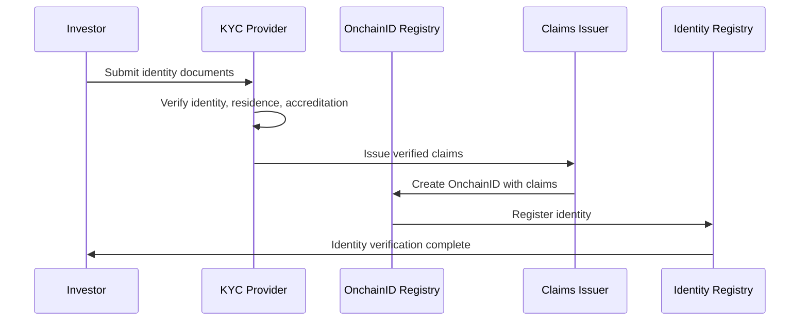
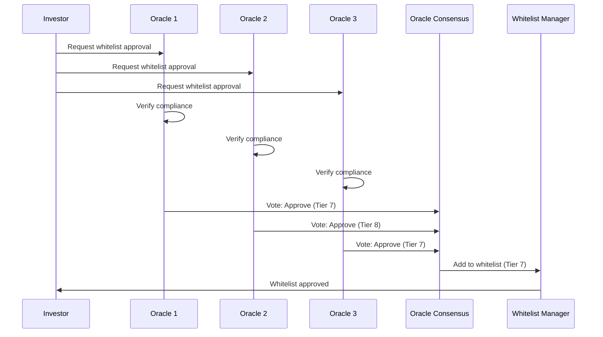
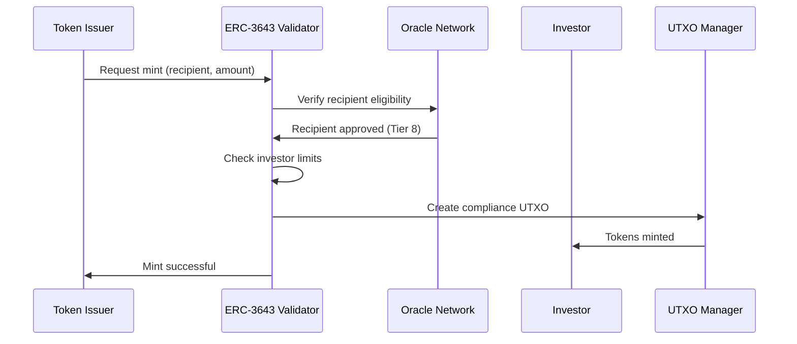
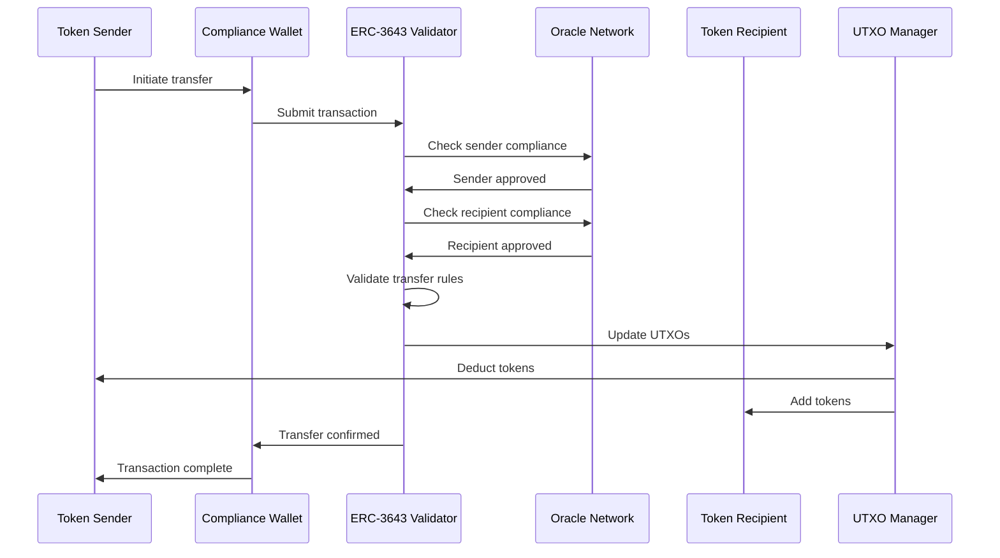
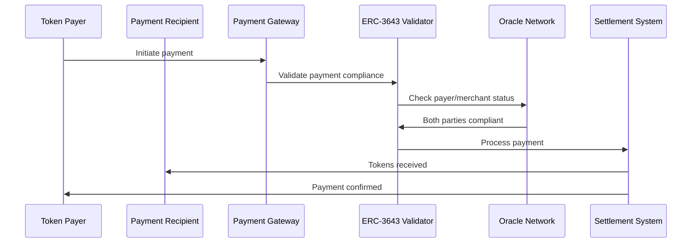
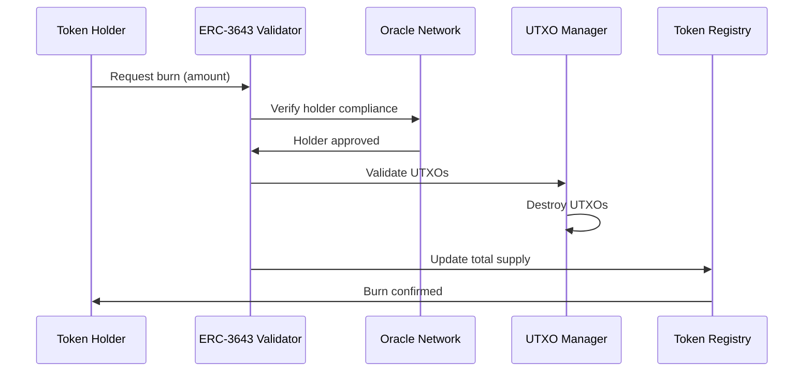
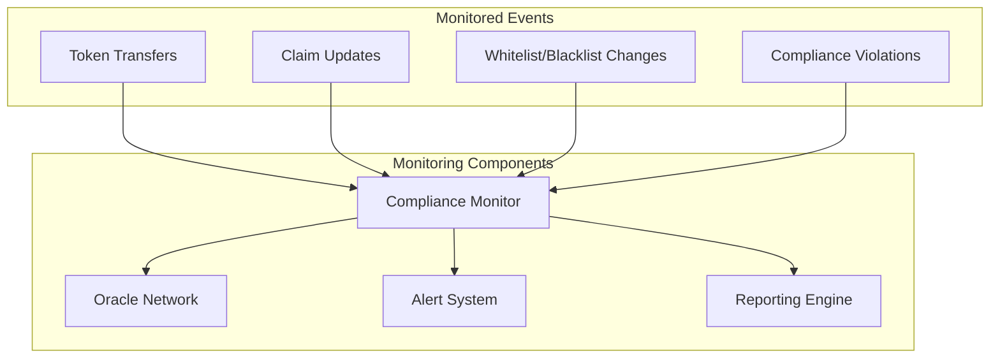

# Vanguard StableCoin - System Workflow Guide

## Overview

This document explains the complete system workflow for users to interact with the Vanguard StableCoin (VSC) system. The system provides 11 core workflows: **User Onboarding**, **Token Minting**, **Token Transfer**, **Oracle Access Control**, **Privacy & ZK Verification**, **Token Burning**, **Investor Type Management**, **Governance**, **Enhanced Escrow**, **Payment Protocol**, and **Complete System Integration**, all with comprehensive compliance validation through the interactive demo system (83 menu options).

## System Architecture

The system is built on a comprehensive smart contract architecture located in the `contracts/` directory:

```
contracts/
├── onchain_id/
│   ├── OnchainIDFactory.sol      # OnchainID factory contract
│   ├── OnchainID.sol             # Core OnchainID contract (ERC-734/735)
│   ├── ClaimIssuer.sol           # Claim issuer contract
│   ├── KeyManager.sol            # Key management utilities
│   └── interfaces/
│       ├── IERC734.sol           # ERC-734 interface
│       ├── IERC735.sol           # ERC-735 interface
│       └── IOnchainID.sol        # OnchainID interface
├── erc3643/
│   ├── Token.sol                 # Vanguard StableCoin token contract
│   ├── TokenMinting.sol          # Token minting system with limits
│   ├── TokenBurning.sol          # Token burning system
│   ├── IdentityRegistry.sol      # Identity registry contract
│   ├── ComplianceRegistry.sol    # Compliance registry contract
│   ├── TrustedIssuersRegistry.sol # Trusted issuers registry
│   ├── ClaimTopicsRegistry.sol   # Claim topics registry
│   └── interfaces/
│       ├── IERC3643.sol          # ERC-3643 interface
│       ├── IIdentityRegistry.sol # Identity registry interface
│       └── ICompliance.sol       # Compliance interface
├── oracle/
│   ├── OracleManager.sol         # Oracle management contract
│   ├── WhitelistOracle.sol       # Whitelist oracle contract
│   ├── BlacklistOracle.sol       # Blacklist oracle contract
│   ├── ConsensusOracle.sol       # Oracle consensus contract
│   └── interfaces/
│       ├── IOracle.sol           # Oracle interface
│       └── IOracleManager.sol    # Oracle manager interface
├── compliance/
│   ├── UTXOCompliance.sol        # UTXO compliance contract
│   ├── ComplianceValidator.sol   # Compliance validation contract
│   ├── TransferRestrictions.sol  # Transfer restrictions contract
│   └── interfaces/
│       ├── IUTXOCompliance.sol   # UTXO compliance interface
│       └── IComplianceValidator.sol # Compliance validator interface
├── privacy/
│   ├── ZKVerifier.sol            # Zero-knowledge proof verifier
│   ├── PrivacyManager.sol        # Privacy management contract
│   └── interfaces/
│       └── IZKVerifier.sol       # ZK verifier interface
├── test/
│   ├── mocks/
│   │   ├── MockOnchainID.sol     # Mock OnchainID for testing
│   │   ├── MockOracle.sol        # Mock oracle for testing
│   │   └── MockERC3643.sol       # Mock ERC-3643 for testing
│   └── helpers/
│       ├── TestHelpers.sol       # Test helper functions
│       └── DeploymentHelpers.sol # Deployment helper functions
├── migrations/
│   ├── 1_initial_migration.js
│   ├── 2_deploy_onchain_id.js
│   ├── 3_deploy_erc3643.js
│   ├── 4_deploy_oracle.js
│   └── 5_deploy_compliance.js
├── hardhat.config.js
├── package.json
└── README.md
```

All user workflows interact with these smart contracts through the Rust backend, which provides additional validation, caching, and off-chain compliance management.

### Architecture Overview

For the complete system architecture and high-level workflow diagrams, see the [Design Document](.kiro/specs/cmta-utxo-poc/design.md) which provides:

- **High-Level System Workflow**: Overall transaction validation flow
- **Component Architecture**: Detailed system component interactions
- **Integration Patterns**: OnchainID and ERC-3643 integration architecture
- **Oracle Network Design**: Oracle consensus and list management
- **Privacy Layer Design**: Zero-knowledge proof integration

## Supported Workflows

The system supports the following core workflows, each with comprehensive compliance validation:

| Workflow | Description | Key Components |
|----------|-------------|----------------|
| **User Onboarding** | KYC/AML verification and OnchainID creation | OnchainID Factory, Claims Issuer, Identity Registry |
| **Token Minting** | Authorized token creation with compliance validation | ERC-3643 Token, Compliance Validator, Oracle Network |
| **Token Transfer** | Peer-to-peer transfers with UTXO compliance | UTXO Compliance, Transfer Restrictions, Oracle Consensus |
| **Token Payment** | Payment processing with atomic transfers | Payment Processor, Compliance Validator, Event Reporter |
| **Token Burning** | Authorized token destruction and compliance tracking | Token Contract, UTXO Store, Regulatory Reporter |

## Table of Contents

1. [User Onboarding Process](#user-onboarding-process)
2. [Token Minting Workflow](#token-minting-workflow)
3. [Token Transfer Workflow](#token-transfer-workflow)
4. [Token Payment Workflow](#token-payment-workflow)
5. [Token Burning Workflow](#token-burning-workflow)
6. [Compliance Monitoring](#compliance-monitoring)
7. [Error Handling](#error-handling)

---

## User Onboarding Process

### Phase 1: Identity Verification



#### Step 1: KYC/AML Verification
- **Required Documents**: 
  - Government-issued ID (passport, driver's license)
  - Proof of address (utility bill, bank statement)
  - Accreditation documents (for accredited investors)
  - Source of funds documentation
- **Verification Process**: 
  - Identity verification (name, date of birth, address)
  - AML screening against sanctions lists
  - Accreditation status verification
  - Country eligibility check

#### Step 2: OnchainID Creation and Smart Contract Registration
```javascript
// Smart contract interaction for OnchainID creation
const onchainIDFactory = await ethers.getContractAt("OnchainIDFactory", FACTORY_ADDRESS);

// Create OnchainID for user
const tx = await onchainIDFactory.createIdentity(
    userAddress,
    ethers.utils.keccak256(ethers.utils.toUtf8Bytes("unique_salt"))
);
const receipt = await tx.wait();
const onchainIDAddress = receipt.events[0].args.identity;

// Register identity in ERC-3643 Identity Registry
const identityRegistry = await ethers.getContractAt("IdentityRegistry", IDENTITY_REGISTRY_ADDRESS);
await identityRegistry.registerIdentity(
    userAddress,
    onchainIDAddress,
    countryCode // e.g., 840 for US
);
```

#### Step 3: Claims Issuance
```javascript
// Issue KYC claim
const claimIssuer = await ethers.getContractAt("ClaimIssuer", CLAIM_ISSUER_ADDRESS);
const kycClaimTopic = 1;
const kycClaimData = ethers.utils.toUtf8Bytes("KYC_VERIFIED");

await claimIssuer.issueClaim(
    onchainIDAddress,
    kycClaimTopic,
    kycClaimData
);

// Issue accreditation claim (if applicable)
const accreditationClaimTopic = 5;
const accreditationData = ethers.utils.toUtf8Bytes("ACCREDITED_INVESTOR");

await claimIssuer.issueClaim(
    onchainIDAddress,
    accreditationClaimTopic,
    accreditationData
);
```

#### Step 2: OnchainID Creation
- **OnchainID Deployment**: 
  - KYC provider calls OnchainIDFactory to deploy new OnchainID contract
  - OnchainID implements ERC-734 (Key Management) and ERC-735 (Claim Holder)
  - User's wallet address added as management key
  - Deterministic address generation using CREATE2
- **Claims Issued**:
  - `IDENTITY_CLAIM` (Topic 1): Verified identity information
  - `RESIDENCE_CLAIM` (Topic 3): Country of residence
  - `ACCREDITATION_CLAIM` (Topic 5): Investor type and accreditation status
  - `KYC_CLAIM` (Topic 6): KYC verification status
  - `AML_CLAIM` (Topic 7): AML screening results
  - `INVESTOR_TYPE_CLAIM` (Topic 8): Investor classification
- **Claim Verification**:
  - Each claim cryptographically signed by trusted issuer
  - Claims stored in OnchainID contract with signature verification
  - Claim topics registered in ClaimTopicsRegistry

#### Step 3: Identity Registry Registration
- OnchainID address registered in ERC-3643 Identity Registry
- Claims verified by trusted issuers through ClaimIssuer contract
- Country and investor type extracted from OnchainID claims
- Identity verification status updated in registry

### Phase 2: Oracle Whitelist Approval



#### Whitelist Tiers
- **Tier 1-3**: Retail investors (limited access)
- **Tier 4-6**: Professional investors
- **Tier 7-8**: Accredited investors
- **Tier 9-10**: Institutional investors

---

## Token Minting Workflow

### Authorized Minting Process



### Minting Requirements

#### For the Issuer:
- Must have `MINTER_ROLE` in the token contract
- Must specify valid recipient address
- Must not exceed total supply limits

#### For the Recipient:
- Must be KYC/AML verified
- Must be whitelisted by oracles
- Must be registered in identity registry
- Must not exceed investor count limits
- Country must be in allowed jurisdictions

### Minting Process Steps

1. **Issuer Initiates Mint**
   ```solidity
   function mint(address to, uint256 amount) external onlyRole(MINTER_ROLE) {
       require(canReceive(to, amount), "Recipient not compliant");
       _mint(to, amount);
   }
   ```

2. **Compliance Validation**
   - Verify recipient's OnchainID exists
   - Check required claims are present and valid
   - Verify oracle whitelist status
   - Check blacklist status
   - Validate country restrictions
   - Check investor count limits

3. **UTXO Creation**
   ```rust
   let compliance_utxo = ERC3643ComplianceUTXO {
       value: amount,
       token_address: token_contract,
       onchain_id: recipient_identity,
       whitelist_tier: 8,
       country_code: 840, // US
       investor_type: InvestorType::AccreditedInvestor,
       oracle_whitelist_status: OracleWhitelistStatus::Approved,
       // ... other fields
   };
   ```

4. **Event Emission**
   ```solidity
   emit Transfer(address(0), to, amount);
   emit ComplianceMint(to, amount, whitelistTier);
   ```

---

## Token Transfer Workflow

### Standard Transfer Process



### Transfer Validation Checklist

#### Sender Validation:
- ✅ Identity verified and active
- ✅ Whitelisted by oracles
- ✅ Not blacklisted
- ✅ Sufficient token balance
- ✅ Holding period satisfied
- ✅ Claims still valid

#### Recipient Validation:
- ✅ Identity verified and active
- ✅ Whitelisted by oracles
- ✅ Not blacklisted
- ✅ Country allowed
- ✅ Investor type permitted
- ✅ Investor count not exceeded

#### Transfer Rules:
- ✅ Transfer amount within limits
- ✅ No transfer restrictions active
- ✅ Transfer agent approval (if required)

### Transfer Process Steps

1. **User Interface**
   ```
   ┌─────────────────────────────────────┐
   │ Send CMTA Tokens                    │
   ├─────────────────────────────────────┤
   │ To Address: 0x742d35Cc6634C0532... │
   │ Amount: 1,000 CMTA                  │
   │ ⚠️  Validating compliance...        │
   │                                     │
   │ Sender Status: ✅ Verified          │
   │ Recipient Status: ⏳ Checking...    │
   └─────────────────────────────────────┘
   ```

2. **Real-time Validation**
   ```rust
   async fn validate_transfer(
       from: &Address,
       to: &Address,
       amount: u64,
   ) -> Result<ValidationResult> {
       // Check sender compliance
       let sender_status = oracle_network.verify_compliance(from).await?;
       if !sender_status.is_compliant() {
           return Err(ValidationError::SenderNotCompliant);
       }
       
       // Check recipient compliance
       let recipient_status = oracle_network.verify_compliance(to).await?;
       if !recipient_status.is_compliant() {
           return Err(ValidationError::RecipientNotCompliant);
       }
       
       // Validate transfer rules
       validate_transfer_rules(from, to, amount).await
   }
   ```

3. **UTXO Updates**
   - Spend sender's UTXOs
   - Create new UTXOs for recipient
   - Update compliance metadata
   - Record transaction in audit trail

---

## Token Payment Workflow

### Payment Processing



### Payment Types

#### 1. Direct Token Payment
- **Use Case**: Direct transfer for goods/services
- **Process**: Standard transfer with payment metadata
- **Compliance**: Both parties must be compliant

#### 2. Escrow Payment
- **Use Case**: Conditional payments with release conditions
- **Process**: Tokens held in smart contract escrow
- **Compliance**: Escrow contract must be whitelisted

#### 3. Recurring Payment
- **Use Case**: Subscription or installment payments
- **Process**: Pre-authorized recurring transfers
- **Compliance**: Ongoing compliance monitoring required

### Payment Validation

```rust
pub struct PaymentRequest {
    pub payer: Address,
    pub recipient: Address,
    pub amount: u64,
    pub payment_type: PaymentType,
    pub metadata: PaymentMetadata,
}

pub enum PaymentType {
    Direct,
    Escrow { release_conditions: Vec<Condition> },
    Recurring { frequency: Duration, total_payments: u32 },
}

async fn process_payment(request: PaymentRequest) -> Result<PaymentResult> {
    // Validate both parties
    validate_payment_compliance(&request.payer, &request.recipient).await?;
    
    // Check payment-specific rules
    match request.payment_type {
        PaymentType::Direct => process_direct_payment(request).await,
        PaymentType::Escrow { .. } => process_escrow_payment(request).await,
        PaymentType::Recurring { .. } => process_recurring_payment(request).await,
    }
}
```

---

## Token Burning Workflow

### Authorized Burning Process



### Burning Requirements

#### For Token Holders:
- Must own sufficient tokens
- Must be compliant (not blacklisted)
- Must satisfy any lock-up periods
- May require transfer agent approval

#### For the System:
- Must update total supply
- Must destroy corresponding UTXOs
- Must maintain audit trail
- Must check for any restrictions

### Burning Process Steps

1. **Burn Request**
   ```solidity
   function burn(uint256 amount) external {
       require(balanceOf(msg.sender) >= amount, "Insufficient balance");
       require(canBurn(msg.sender, amount), "Burn not allowed");
       _burn(msg.sender, amount);
   }
   ```

2. **Compliance Validation**
   ```rust
   async fn validate_burn(
       holder: &Address,
       amount: u64,
   ) -> Result<BurnValidation> {
       // Check holder is not blacklisted
       let blacklist_status = oracle_network.check_blacklist(holder).await?;
       if blacklist_status.is_blacklisted() {
           return Err(BurnError::HolderBlacklisted);
       }
       
       // Check lock-up periods
       let lockup_status = check_lockup_periods(holder, amount).await?;
       if !lockup_status.can_burn() {
           return Err(BurnError::TokensLocked);
       }
       
       Ok(BurnValidation::Approved)
   }
   ```

3. **UTXO Destruction**
   - Select UTXOs to burn
   - Validate UTXO ownership
   - Destroy selected UTXOs
   - Update holder's balance

---

## Compliance Monitoring

### Continuous Monitoring System



### Monitoring Activities

#### 1. Real-time Compliance Checks
- **Identity Status**: Monitor OnchainID validity
- **Claims Expiry**: Track claim expiration dates
- **Oracle Lists**: Monitor whitelist/blacklist changes
- **Regulatory Updates**: Track regulatory requirement changes

#### 2. Automated Alerts
- **Compliance Violations**: Immediate alerts for violations
- **Claim Expiry**: Warnings before claims expire
- **Suspicious Activity**: Unusual transaction patterns
- **Regulatory Changes**: Updates to compliance requirements

#### 3. Periodic Reviews
- **Quarterly Reviews**: Comprehensive compliance assessment
- **Annual Audits**: Full system compliance audit
- **Regulatory Reporting**: Automated regulatory reports
- **Performance Metrics**: System performance analysis

---

## Error Handling

### Common Error Scenarios

#### 1. Identity Verification Errors
```
❌ Identity Verification Failed
Error Code: ID_001
Reason: OnchainID not found in registry
Resolution: Complete identity verification process
Estimated Time: 2-5 business days
```

#### 2. Compliance Validation Errors
```
❌ Transfer Rejected
Error Code: COMP_003
Reason: Recipient not whitelisted
Details: 
- Recipient address: 0x742d35Cc...
- Required whitelist tier: 5
- Current status: Not whitelisted
Resolution: Recipient must complete oracle whitelist approval
```

#### 3. Oracle Consensus Errors
```
❌ Oracle Consensus Failed
Error Code: ORC_002
Reason: Insufficient oracle responses
Details:
- Required consensus: 3 of 5 oracles
- Received responses: 2 of 5 oracles
- Failed oracles: Oracle-3, Oracle-5
Resolution: Retry transaction or wait for oracle recovery
```

#### 4. Regulatory Compliance Errors
```
❌ Regulatory Violation
Error Code: REG_005
Reason: Country restriction violation
Details:
- Sender country: United States
- Recipient country: Restricted Territory
- Applicable regulation: OFAC Sanctions
Resolution: Transfer not permitted under current regulations
```

### Error Recovery Process

1. **Automatic Retry**: System automatically retries failed operations
2. **Fallback Mechanisms**: Use cached data when oracles unavailable
3. **Manual Review**: Complex cases escalated to compliance team
4. **User Notification**: Clear error messages with resolution steps

---

## System Status Dashboard

### User Dashboard Example
```
┌─────────────────────────────────────────────────────────┐
│ CMTA Token Compliance Dashboard                         │
├─────────────────────────────────────────────────────────┤
│ Account Status: ✅ Fully Compliant                     │
│ Whitelist Tier: 8 (Accredited Investor)                │
│ Token Balance: 25,000 CMTA                             │
│ Available for Transfer: 25,000 CMTA                    │
├─────────────────────────────────────────────────────────┤
│ Compliance Status:                                      │
│ • Identity Verified: ✅ Valid until 2025-12-31        │
│ • KYC Status: ✅ Current                               │
│ • AML Screening: ✅ Clear                              │
│ • Accreditation: ✅ Valid until 2025-06-30            │
│ • Oracle Whitelist: ✅ Tier 8                         │
│ • Blacklist Status: ✅ Clear                          │
├─────────────────────────────────────────────────────────┤
│ Recent Activity:                                        │
│ • 2024-01-15: Received 5,000 CMTA from 0x123...       │
│ • 2024-01-10: Sent 2,000 CMTA to 0x456...             │
│ • 2024-01-05: Compliance review completed              │
├─────────────────────────────────────────────────────────┤
│ Actions:                                                │
│ [Send Tokens] [Request Payment] [View History]         │
└─────────────────────────────────────────────────────────┘
```

This comprehensive workflow ensures that all token operations (mint, burn, transfer, payment) maintain full regulatory compliance while providing a smooth user experience for qualified investors.