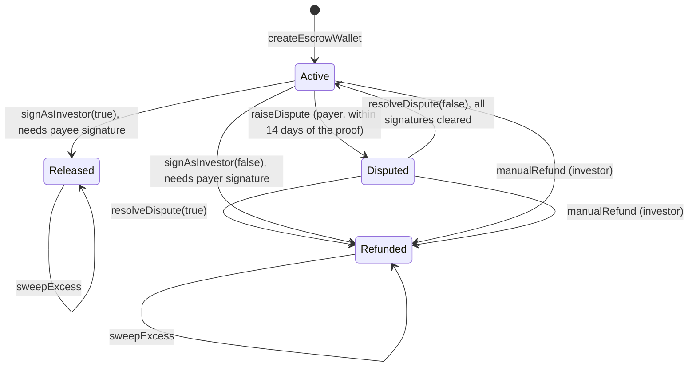

# Vanguard StableCoin - System Workflow Guide

## Overview

How the contracts in `contracts/` are used, workflow by workflow, with the
interactive demo option that runs each step (`npm run
demo:interactive:proof`; the menu is `demo/core/MenuSystem.js`). Every
contract, function and option named here exists in this tree. The
governance votes and the handover ceremony are in `docs/TESTNET_DEMO.md`;
investor types in `docs/INVESTOR_TYPE_SYSTEM.md`.

## Contracts

```
contracts/
├── onchain_id/       OnchainID (ERC-735 claims) on OnchainIDKeys (ERC-734
│                     keys), OnchainIDFactory, ClaimIssuer on
│                     ClaimIssuerKeys, KeyManager on KeyManagerRecovery
├── erc3643/          Token (VSC), IdentityRegistry, InvestorTypeRegistry
├── compliance/       ComplianceRules on ComplianceRulesAdmin and
│                     ComplianceRulesTrust (one deployed contract)
├── oracle/           OracleManager (the gate), ConsensusOracle (its
│                     engine), WhitelistOracle and BlacklistOracle (both
│                     on ListOracleBase)
├── privacy/          PrivacyManager on PrivacyAttestationPolicy,
│                     ZKVerifierIntegrated on ZKVerifierAdmin,
│                     DynamicListManager, verifiers/ (five snarkjs PLONK
│                     verifiers)
├── investor/         InvestorRequestManager, MultiSigWallet (custody)
├── payment/          EscrowWalletFactory, MultiSigEscrowWallet on
│                     MultiSigEscrowTerms
├── governance/       GovernanceToken (VGT), VanguardGovernance on
│                     GovernanceProposals and GovernanceConfig
└── test/             MockTarget and mocks/ (tests only)
```

Each folder has its interfaces in `interfaces/`; `contracts/README.md`
and the folder READMEs describe the contracts. "X on Y" means Y is an
abstract base of X, not deployed on its own: X is one contract at one
address. The Task 4.8 splits changed storage layouts, so a deployment made
before them is redeployed, not upgraded (there are no proxies).

## Workflows

| Workflow                       | Contracts                                                        | Demo options              |
| ------------------------------ | ---------------------------------------------------------------- | ------------------------- |
| User onboarding                | OnchainIDFactory, ClaimIssuer, IdentityRegistry                  | 1, 3, 6, 7, 23, 24        |
| Identity keys                  | OnchainID, KeyManager                                            | 2, 4, 5, 5a, 12, 12a, 12b |
| Oracle whitelist and blacklist | OracleManager, ConsensusOracle, WhitelistOracle, BlacklistOracle | 31-40, 33a-35a            |
| Minting                        | Token, ComplianceRules, InvestorTypeRegistry                     | 22, 25                    |
| Transfers                      | Token, ComplianceRules, InvestorTypeRegistry                     | 26, 27, 27.5, 28          |
| Privacy and ZK verification    | ZKVerifierIntegrated, PrivacyManager, ComplianceRules            | 41-50                     |
| Investor custody               | InvestorRequestManager, MultiSigWallet                           | 23, 51                    |
| Escrow payment                 | EscrowWalletFactory, MultiSigEscrowWallet                        | 61-73b                    |
| Burning                        | Token                                                            | (agent call, below)       |
| Governance                     | GovernanceToken, VanguardGovernance                              | 74-83e                    |

## User Onboarding

An investor needs an OnchainID, a registry entry and one valid claim per
required topic from a trusted issuer.

1. **Identity.** `OnchainIDFactory.deployOnchainID(owner, salt)` deploys
   an OnchainID (CREATE2; `computeOnchainIDAddress` predicts it) whose
   owner and first MANAGEMENT key is the investor's wallet.
2. **Registration.** A registry agent calls
   `IdentityRegistry.registerIdentity(wallet, identity, country)`
   (ISO 3166-1 numeric). With a jurisdiction source set, a country the
   token's ComplianceRules rule refuses reverts ("Country not allowed:
   ...", event `IdentityRegistrationRejected`). One identity binds one
   wallet.
3. **Claims.** A trusted issuer's key signs the claim data and the issuer
   calls `ClaimIssuer.issueClaim(identity, topic, scheme, data, uri,
validTo, signature)`. The ClaimIssuer keeps the claim; a copy written to
   the OnchainID is a record only (`demo/utils/Kyc.js`).
4. **Verification.** `IdentityRegistry.isVerified(wallet)` is true when
   every topic in `getClaimTopics()` (6 KYC and 7 AML in the demo) has a
   trusted issuer (`addTrustedIssuer`) whose `hasValidClaim(identity,
topic)` answers true for its latest claim on that topic
   (`latestClaimId`): not revoked (`revokeClaim`) and not past `validTo`
   (0 = no expiry). No topics verifies nobody, and the last topic cannot
   be removed. `refreshVerified(wallet)` (anyone) caches a passing walk
   for the identity up to 24 hours, capped at the claims' `validTo`. With
   no cached entry a revocation counts at once; with one, it counts once
   anyone refreshes or the entry lapses (TESTNET_DEMO.md, "The
   verification cache").

Demo: option 3 creates the OnchainID, 6 and 7 issue the KYC and AML
claims, 8 reviews them, 11 shows a short-lived claim expiring; options 23
and 24 onboard users in one step.

### Identity key lifecycle (KeyManager)

`KeyManager` rotates and recovers the keys of an OnchainID behind
timelocks. It has no owner and no allowlist of its own. An identity opts in
with `OnchainID.authorizeManager(keyManager)`, which only the identity's
owner can send; while it is authorized, KeyManager may add and remove the
identity's keys. Every KeyManager write for an identity needs the caller
to hold a MANAGEMENT key on it (or, for recovery, to be one of its agents)
and the identity to have authorized KeyManager ("KeyManager: Identity has
not authorized KeyManager" otherwise).

`deauthorizeManager` pauses KeyManager for the identity; it does not
cancel. While withdrawn nothing executes and agents can neither open nor
approve candidates; `cancelKeyRotation` and `cancelKeyRecovery` work while
withdrawn and are how to stop an item. A rotation or recovery executes
only within `EXECUTION_WINDOW` (7 days) after its execution time; after
that it reverts ("execution window passed, re-initiate"), so an item
paused for longer cannot revive when the identity re-authorizes.

- **Rotation**: a MANAGEMENT key calls `initiateKeyRotation(identity,
oldKey, newKey, purpose)`; after the timelock anyone calls
  `executeKeyRotation`, which adds the new key and revokes the old one. The
  timelock is 24 hours (`DEFAULT_TIMELOCK`) unless the identity's own
  MANAGEMENT key set another with `setCustomTimelock` (1 hour to 7 days;
  it applies to rotations initiated afterwards). A rotation whose initiator
  lost its MANAGEMENT key before execution does not run; any current
  MANAGEMENT key can `cancelKeyRotation`. The timelock binds only rotations
  through KeyManager: a MANAGEMENT key adds and removes keys at once
  (ERC-734), through `batchAddKeys`/`batchRemoveKeys` or `OnchainID.addKey`/
  `removeKey`, so the timelock gives the holder visibility, not a control
  against a compromised MANAGEMENT key. This is by design (Task 4.5,
  R-45-1): `executeKeyRotation` and `executeKeyRecovery` themselves call
  `addKey`, so a timelock inside `addKey` would either block them or tie
  the identity to one manager. A MANAGEMENT key can also cancel or re-seat
  KeyManager recovery. The defence against a rogue MANAGEMENT key is the
  owner: `owner()` always passes `onlyManagementKey`, so it can
  `removeKey` the rogue key, and it alone controls `authorizeManager`,
  `deauthorizeManager` and `transferOwnership`. Recovery restores a lost
  key; it does not evict a key that is still active.
- **Removal with the holder's consent**: `removeKey` is the management
  action (no consent; KeyManager batches and rotations use it, and it is
  the only path for a non-ECDSA key). `OnchainID.removeKeyWithProof(key,
purpose, signature)` is still sent by a MANAGEMENT key but also needs
  the key's own address to have signed `getRemoveKeyMessage(key,
purpose)` (identity, key, purpose, the key's removal nonce and chain id,
  so a signature removes the key once; the returned digest is
  already EIP-191 prefixed, so the holder signs the inner keccak256 with
  `signMessage`). Demo options 5 -> 1 and 5a.
- **Recovery**: a MANAGEMENT key names up to ten distinct recovery agents
  and a threshold (`setupKeyRecovery`), while the holder still holds its
  key. An agent opens a candidate key (`initiateKeyRecovery`), agents
  approve it, and after 48 hours (`RECOVERY_TIMELOCK`) with enough
  approvals anyone executes it: the key is added as MANAGEMENT and
  recovery closes until the next setup. Agents at threshold need no
  further consent from the holder: the owner, a MANAGEMENT key or the
  candidate's initiator can cancel within those 48 hours, and otherwise
  the key is added. Recovery restores a MANAGEMENT key only, never
  `owner()` (ownership and `authorizeManager` stay with the owner
  address), and a thief holding a MANAGEMENT key can cancel or re-run the
  setup, so recovery covers a lost key, not a compromised one. Each
  candidate has its own approvals and timelock; an expired candidate can
  be re-opened, with its approvals reset.
- **Batch and multi-signature keys**: `batchAddKeys` and `batchRemoveKeys`
  write several keys in one call; `addMultiSigKey` records an N-of-M
  signer set that `signMultiSigOperation` and `checkMultiSigThreshold`
  count. The multi-signature record is bookkeeping: nothing in KeyManager
  executes on it.

A wallet recovered with `Token.recoveryAddress` votes only once it holds a
key on its OnchainID; KeyManager recovery is the designed path. The demo
exercises the lifecycle in options 12, 12a, 12b, 5 and 5a
(docs/TESTNET_DEMO.md, "Identity keys through KeyManager"); its resume
works within one demo session only.

## Oracle Whitelist and Blacklist

```mermaid
sequenceDiagram
    participant Node1 as Node 1 (wallet 1)
    participant Node2 as Node 2 (wallet 2)
    participant Manager as OracleManager (the gate)
    participant Engine as ConsensusOracle (engine)
    participant Whitelist as WhitelistOracle

    Node1->>Manager: submitQuery(investor, WHITELIST)
    Manager->>Engine: openQuery: snapshot every registered node (300)
    Node1->>Manager: submitResponse(query, YES)
    Manager->>Engine: recordVote (100 of 300)
    Node2->>Manager: submitResponse(query, YES)
    Manager->>Engine: recordVote (200 of 300 meets 66%)
    Engine-->>Manager: resolved YES; the manager stamps resolvedAt
    Node1->>Whitelist: provideAttestation(investor, query, YES, signature)
    Whitelist->>Manager: getQueryBinding, getQueryResolution
    Whitelist->>Whitelist: add the investor (tier 3, the consensus default)
```

Plan v2 Task 4.4 (D11 a): OracleManager is the only vote entry and
ConsensusOracle the engine it delegates the weighted tally to. A paused
node cannot answer or attest but stays in the denominator, so pausing
never lowers the bar; the operator (ops) pauses, unpauses and
emergency-designates nodes; governance removes them and sets the
threshold by an OracleParameters vote. Demo options 33a, 34a and 35a run
this path without prompts (docs/TESTNET_DEMO.md, "Oracle nodes and
consensus").

WhitelistOracle tiers run 1 to 5 (higher is better); a consensus verdict
adds the subject at tier 3. Where a party passes the whitelist by its
oracle entry (OracleOnly, or Either with a live entry), ComplianceRules
requires the entry's tier to reach the party's `requiredWhitelistTier`
in the token's InvestorTypeRegistry (D37 = a, Task 4.10); in ZkOnly, or
for a proof-bound party with no entry, no tier applies (a proof binding
carries none). The whitelist oracle gates VSC only when bound to it in
ComplianceRules
(`setWhitelistOracle`), by the token's whitelist mode (below); the
blacklist oracle bound with `setBlacklistOracle` gates every path.

## Minting

`Token.mint(to, amount)` is agent only (the deployer before the handover,
ops after it) and runs the same check as `canTransfer(address(0), to,
amount)`, reverting with the first failure: `Recipient frozen`,
`Identity not verified`, `Compliance check failed`, `Token not authorized
by investor registry`, `Holding limit exceeded` (a paused token reverts
before it, `EnforcedPause`). For a mint, `ComplianceRules.canTransfer` applies the
list gates to the recipient (the blacklist, and the whitelist by mode and,
on an oracle entry, the recipient's investor-type tier) and,
with an identity registry bound for the token, its country rule. The
investor type's holding cap comes from InvestorTypeRegistry. Demo: option
25 mints to the central bank and distributes; 22 creates the issuer.

## Transfers

`transfer` and `transferFrom` run `Token._checkTransfer(from, to,
amount)` and revert with its reason:

1. A paused token reverts `EnforcedPause` and a frozen sender `Address
is frozen` before the check; inside it, `Recipient frozen`.
2. Unless one side is a trusted contract on this token: `Sender not
verified`, `Recipient not verified` (`IdentityRegistry.isVerified`).
3. `Insufficient balance` (the free balance: balance minus partially
   frozen tokens).
4. `Compliance check failed` when `ComplianceRules.canTransfer` is false:
   the blacklist oracle refuses either party (on every path, the trusted
   one included); no identity registry is bound for the token (fail
   closed); on the trusted path the non-trusted counterparty is not
   verified, not allowed by the whitelist or not allowed by the country
   rule; otherwise either party fails the whitelist (by `whitelistMode`:
   OracleOnly, ZkOnly, Either; a party passing by its oracle entry also
   needs that entry's tier at its investor type's `requiredWhitelistTier`,
   Task 4.10, named by `ComplianceRules.whitelistTierAllows`) or the
   country rule (`setJurisdictionRule(token, allowed, blocked)`; the
   default blocked list always applies).
5. With an InvestorTypeRegistry bound: `Token not authorized by investor
registry` while the registry has not authorized the token
   (`authorizeToken`, fail closed); then, for a non-trusted sender,
   `Transfer amount limit exceeded` (its per-transfer cap) and `Transfer
cooldown` (inside its type's `transferCooldownMinutes` since its last
   send, Task 4.10); then `Holding limit exceeded` (a non-trusted
   recipient's holding cap). A trusted contract's own side skips its cap
   and has no cooldown (D26).

After a successful `transfer` or `transferFrom` the token calls the
registry's `recordTransfer(from)` for a non-trusted sender, starting its
cooldown (an authorized token only); mint, burn and recovery do not.

`canTransfer(from, to, amount)` answers the same question without
reverting. Demo: options 26, 27 and 27.5 transfer between investors and
users; 28 shows a refused over-cap transfer and a non-compliant
recipient; 18 tests the compliance validations.

## Privacy & ZK Verification Workflow

Demo option 1 deploys `ZKVerifierIntegrated` (real verification,
`testingMode` false) and `PrivacyManager`; option 21 points ComplianceRules
at the PrivacyManager for VSC with the whitelist mode left at OracleOnly
(off). Option 41 attaches the pair and initialises the proof generator;
there is no mock mode in the demo, mocks live only in the tests.

Each investor keeps a secret and hands the operator the commitment
`Poseidon(identity, secret)` (identity = its OnchainID address). The
operator (the owner before the handover, ops after it) publishes the root
of the commitments on PrivacyManager; the investor proves membership with
a PLONK proof bound to its own wallet and submits it, and
`hasValidWhitelistProof(wallet)` is what ComplianceRules reads.

Option 42 -> 1 runs this on the live token: (a) VSC switches to whitelist
mode Either, which with no whitelist oracle bound is an allow list of
bindings; (b) the bound wallet transfers VSC to another bound, verified
wallet; (c) a verified wallet without a binding is refused; (d) the
operator rotates the root without the sender's commitment and the
sender's transfer is refused; (e) the sender re-onboards with a new
secret, re-proves and re-binds, and the transfer succeeds again.

Option 42 -> 2 proves the bound wallet's identity is not on the
BlacklistOracle's list; a demonstration only, nothing on chain gates on it
(D2).

Jurisdiction, accreditation and compliance aggregation are issuer-signed
attestations (D31 a). A trusted issuer signs the investor's attributes
with an EdDSA Baby Jubjub key (`scripts/zk/attest.js`); the investor
proves the signature and PrivacyManager's policy (the allowed jurisdiction
mask, the minimum accreditation, the compliance minimum and weights)
without revealing the attributes, and binds the record with
`submitAttestationProof` (`scripts/zk/prove-attestation.js`). PrivacyManager
accepts only issuer keys it trusts for the circuit, the current policy and
the submitting wallet, and keeps one wallet per attestation per policy;
`validatePrivateJurisdiction`, `validatePrivateAccreditation`,
`validatePrivateCompliance` and `validateAllPrivateCompliance` read the
records under each user's preference flags. Options 42 -> 3, 4 and 5 run
this with the demo's issuer key; 44, 45 and 46 show the records. The
issuer keys and the policies are owner settings, PrivacyParameters votes
(type 11) after the handover. See `docs/TESTNET_DEMO.md` for the
command-line tools and the runbook rules.

The jurisdiction set for private proofs is ComplianceRules' rule for VSC,
the same one transfers enforce (Task 3.8): the allowed mask is the OR of
the bits of the registered ISO codes ComplianceRules (`VSC.compliance()`,
read on every use) admits for VSC.
PrivacyManager only assigns each ISO 3166-1 numeric code an append-only
bit (`registerJurisdictionCode`, at most 64; the issuer attests the bit,
`attest.js --country`); a code gets a bit before it can be attested.
Blocking a country in ComplianceRules is enough to stop it on the private
path, and any rule change for VSC lapses the jurisdiction records (rule
version) and frees the attestation for a re-proof, so restoring a rule
revives none. An attestation is signed for one chain and one
PrivacyManager; another deployment refuses it.

An attestation expires on the date the issuer signs into it (Task 3.10):
`attest.js --sign` requires `--valid-days` or `--valid-until`, the proof
publishes `validUntil`, PrivacyManager refuses the proof from that date on
(`AttestationExpired`) and caps the record's `expiresAt` at it, so a
record never outlives its attestation. Re-attestation renews: the issuer
signs a new attestation and the investor proves again. The demo signs for
one year.

## Investor custody (2-of-2 MultiSigWallet)

Plan v2 Task 4.3 (owner decision D13 = b). An investor-status request locks VSC in a contract custody wallet, not as a freeze in the user's own wallet.

| Step (demo option 23) | Who signs             | On chain                                                                                                                                                                                                                               |
| --------------------- | --------------------- | -------------------------------------------------------------------------------------------------------------------------------------------------------------------------------------------------------------------------------------- |
| 2. Request            | User                  | `InvestorRequestManager.requestInvestorStatus(type)`: needs a verified, Normal holder; the lock amount comes from `lockRequirements`                                                                                                   |
| 4. Create wallet      | Bank (ops, wallet 10) | `createMultiSigWallet(user)` deploys `MultiSigWallet(bank, user, VSC)`; the manager, a ComplianceRules registrar for the `MultiSigWallet` code hash, trusts it on VSC in the same call; the address is read back from `requests(user)` |
| 5. Lock               | User                  | `approve(wallet, amount)`, `MultiSigWallet.lockTokens(amount)` (the tokens move into the wallet), `confirmTokensLocked()`                                                                                                              |
| 6. Approve            | Bank                  | `approveRequest(user)`: the manager, a compliance officer, assigns the type while the lock is held                                                                                                                                     |
| 8. Downgrade          | User, then bank       | `proposeUnlock(amount, recipient, reason)`, `signUnlock` by both; the second signature pays out. Then a compliance officer sets the type back to Normal                                                                                |

Neither signer can move the tokens alone, and every payout passes the token's gate on the recipient (identity, country, caps). The wallet may also hold escrow investor fees routed to it (option 62); an unlock pays from that free balance first, then from the lock. The demo sets the lock requirements within the Normal type's one-transfer cap (2,000 / 4,000 / 8,000 VSC for Retail / Accredited / Institutional), because the user is still Normal when locking; the contract defaults (10,000 / 100,000 / 1,000,000) exceed the default Normal caps. A platform contract holds client tokens here: the bank alone cannot move them, but it is contract custody.

## Escrow Payment Workflow

A conditional VSC payment between a **payer** and a **payee**, mediated by a registered **investor**. Each payment gets its own `MultiSigEscrowWallet`, deployed by `EscrowWalletFactory` and used exactly once. Demo options 61 to 73b.

### Parties and money

| Party    | Does                                                                                | Must be                                                                                                  |
| -------- | ----------------------------------------------------------------------------------- | -------------------------------------------------------------------------------------------------------- |
| Payer    | Funds the escrow. May dispute. Signs to allow a refund.                             | KYC/AML verified. May be unknown at creation (marketplace): the first verified funder becomes the payer. |
| Payee    | Ships, submits the signed shipment proof, signs to allow a release.                 | KYC/AML verified.                                                                                        |
| Investor | Creates the escrow, states the settlement direction, mediates disputes, may refund. | Registered on the factory (`registerInvestor`, `INVESTOR_ROLE`).                                         |
| Platform | Receives the owner fee.                                                             | Fee wallet set on the factory.                                                                           |

The escrow holds **amount + 3% investor fee + 2% owner fee**, all fixed at creation. A 1000 VSC payment is funded with 1050 VSC. On release the payee gets 1000, the investor fee wallet 30, the platform fee wallet 20. On refund the payer gets the full 1050 back.

The escrow wallet becomes a trusted contract on VSC in the same transaction that creates it: `EscrowWalletFactory` is a ComplianceRules **registrar** on VSC (Task 4.3) and calls `addTrustedContract(VSC, wallet)` itself. The ComplianceRules owner (governance after the handover) names registrars with `setTrustedRegistrar(token, registrar, walletCodeHash)`; a registrar may trust only an account whose runtime code hash equals the registered one (the compiled `MultiSigEscrowWallet`, which keeps its parameters in storage so every escrow has that hash), and only the owner may remove trust. Ops and rule administrators have no trust power. A factory that is not a registrar cannot create escrows: the demo names it at option 61 (a ComplianceRules vote after the handover). Trust is per token since Task 4.1: an escrow trusted on VSC is not trusted on VGT, and governance, trusted on VGT to hold proposal fees, is not trusted on VSC. That is what lets VSC move in and out of a contract that has no identity of its own. Only addresses with code can be trusted: never a wallet, and never a wallet carrying an EIP-7702 delegation (the setter rejects the `0xef0100` indicator). The payer and payee are verified investors, and the other party to every transfer is still checked.

### Lifecycle


```mermaid
stateDiagram-v2
    [*] --> Active : createEscrowWallet
    Active --> Disputed : raiseDispute (payer, within 14 days of the proof)
    Disputed --> Active : resolveDispute(false), all signatures cleared
    Disputed --> Refunded : resolveDispute(true)
    Active --> Released : signAsInvestor(true), needs payee signature
    Active --> Refunded : signAsInvestor(false), needs payer signature
    Active --> Refunded : manualRefund (investor)
    Disputed --> Refunded : manualRefund (investor)
    Released --> Released : sweepExcess
    Refunded --> Refunded : sweepExcess
```

`Active`, `Released`, `Refunded`, `Disputed` are the on-chain states. Funding, the shipment proof, and the payer and payee signatures all happen while the escrow is `Active` and do not change its state; whether it has been funded is a separate on-chain flag, `funded`.

### Steps

**1. Deploy the factory (61).** Needs the ERC-3643 token (21). The demo also onboards the platform fee wallet as a verified investor here.

**2. Register the investor (62).** The investor's fee wallet is set at registration. An investor onboarded through option 23 has a `MultiSigWallet` (see [Investor custody](#investor-custody-2-of-2-multisigwallet)); option 62 uses it as the fee wallet. It is a trusted contract on VSC, not an identity, so it neither counts in the governance electorate nor needs a cap exemption, and fees paid to it leave only with the bank's and the user's signatures. A user created through option 24 has no wallet; the demo falls back to a reserved signer, onboarded as a verified identity. A keyless placeholder fee address left by a pre-4.3 run is retired: a registry agent deletes its identity and the investor is re-registered with the real wallet. Each release adds the investor fee to the factory's `totalFeesEarned` for that investor (option 69 prints it).

**3. Create the escrow (63).** The investor names the payer (or "Unknown" for a marketplace escrow), the payee, and the amount. The factory checks both known parties are verified, deploys the wallet, and emits `EscrowWalletCreated` with the payment id and wallet address.

**4. Fund it (64).** The payer approves the factory for the total and calls `fundEscrowWallet(paymentId)`. The factory pulls the tokens in and then marks the wallet `funded`. **Funding is once only**: a second call reverts `EscrowAlreadyFunded`. The demo checks the flag before asking for the approval, so no gas is spent on a doomed attempt.

**5. Ship and prove (65).** The payee submits the shipment data, its hash, and a signature. The contract recovers the signer from a digest that binds the string `VanguardShipmentProof`, **this escrow's address**, **the chain id**, and the hash, and requires it to be the payee. A signature copied from another escrow or another chain is rejected with `ProofNotSignedByPayee`. Submission starts the **14-day dispute window**.

**6. Dispute window.** While it is open the payer may `raiseDispute` (66) and the payee cannot sign. The investor resolves (67): refund the payer, or reopen the escrow. Reopening clears **all three** signatures, so nothing signed before the dispute carries over. On a local node use 73b to jump past the window; on a real network it closes on its own.

**7. Settle, 2-of-3 with an explicit direction.** The payee signs (68) once the window has closed; the payer may sign at any time while the escrow is active. Neither signature moves funds. The investor then signs (69) and **states the direction**:

| Investor says | Requires         | Result                                                         |
| ------------- | ---------------- | -------------------------------------------------------------- |
| release       | payee has signed | amount to payee, fees to the two fee wallets, state `Released` |
| refund        | payer has signed | full total back to the payer, state `Refunded`                 |

If the required counterparty signature is missing the call reverts (`PayeeHasNotSigned` / `PayerHasNotSigned`). The direction is never inferred from who signed first; that inference used to let a payer pre-sign and turn an intended release into a refund to themselves.

The escrow wallet is a trusted contract, but the human side of every escrow leg still meets its investor-type caps (D26): funding counts against the payer's transfer cap, and a release that would put the payee over its holding cap reverts with `Holding limit exceeded`. The same holds for every recipient of a settlement: a release or refund that would put the payee, the payer or either fee wallet over its holding cap reverts atomically, the escrow stays `Active` (or `Disputed`) and the funds stay in it. The exits are: the over-cap party moves balance out, the registry raises its investor type, or it is exempted (D22). The refund (which needs the payer's signature or a dispute) stays open only while the payer has room under its own holding cap. Option 69 checks every leg before signing and names the one that would fail. The two fee wallets carry the D22 exemption so fees never hit their holding cap: the deploy sets it before the handover (the demo does it in options 61 and 62), after it an InvestorTypeConfig vote (option 76, type 0, choice 2). The handover check warns about any fee wallet (the factory's owner wallet, each registered investor's fee wallet, and a `feeWallets` list in handover.json) that is not exempt on the registry the Token enforces, and about a fee wallet registered after the handover. The factory itself is Ownable2Step and goes to governance at the ceremony: its owner (governance, written into every new escrow) sets the fee wallet, the registry and the rules by an EscrowFactoryParameters vote (type 9), while ops holds ADMIN_ROLE to register and deactivate investors. The OnchainIDFactory follows the same path under IdentityFactoryParameters (type 10). After a wallet recovery, re-assign the investor type (and the exemption, if any) to the new wallet: recovery moves the balance but not the type, so the new wallet holds the old balance as a Normal investor and cannot receive until its type is assigned.

**8. Manual refund (70).** The investor may refund the payer at any time while the escrow is `Active` or `Disputed`, without any other signature.

**9. Sweep what settlement left behind (70a).** See below.

### Why an escrow can hold more than it pays out, and what to do

Release and refund pay **fixed** sums. Anything else that reaches the escrow address is not part of the settlement and stays there:

| How tokens arrive                                           | Stopped?                       | What happens                                |
| ----------------------------------------------------------- | ------------------------------ | ------------------------------------------- |
| `fundEscrowWallet` through the factory                      | Yes, once only (`funded`)      | Second call reverts.                        |
| A plain `transfer(escrowAddress, x)` by any verified holder | No. The factory never sees it. | Lands in the escrow. Settlement ignores it. |

Once the escrow is `Released` or `Refunded`, an escrow party (payer, payee, investor or the platform owner) may call `sweepExcess()`; anyone else gets `NotEscrowParty`. It sends the entire remaining VSC balance to the payer, the party who funds escrows and the only one who plausibly paid twice. If no payer was ever set (a marketplace escrow settled purely from direct transfers) it goes to the platform fee wallet instead, never to the zero address. It reverts while the escrow is still active (`EscrowStillActive`) and when there is nothing to sweep (`NothingToSweep`). It only ever touches the one token the escrow was created for, and the recipient's holding cap applies to the sweep like any other transfer.

Escrows deployed from earlier bytecode do not have this function. Tokens stranded in one of those need a separate recovery decision.

### A demo run that shows the whole thing

On a local node, this order works from a fresh start:

```
1 → 21 → 51 → 22 → 25/1/1          deploy, mint to the central bank
24/1 Alice, 24/1 Bob               payer and payee
23/1 Ivan, then 23/2 … 23/6 for Ivan   investor with a 2-of-2 MultiSigWallet (Task 4.3)
61 → 62 (Ivan) → 63 (Ivan, Alice → Bob, 1000)
64                                  fund: escrow holds 1050
   (send another 1050 straight to the escrow address, outside the factory)
65 → 73b → 68 → 69/1                proof, close the window, payee signs, investor releases
71                                  Released, escrow still holds 1050
70a                                 "Stranded tokens returned … To: <Alice> Amount: 1050.0"
71                                  escrow holds 0
```

Option 71 shows the on-chain state and every party's balance; 71a shows all balances at once.

## Burning

`Token.burn(from, amount)` is agent only. It needs `amount` of free
balance ("Insufficient balance", "Insufficient free balance") and is
never gated by ComplianceRules: burning is how an operator claws tokens
back. GovernanceToken (VGT) has `burn(amount)` for an agent's own
balance; VGT refuses agent levers (burn, freeze, recovery) on a trusted
contract such as governance (D23). Demo: option 75b burns VGT.

## Governance

One verified identity, one vote; VGT pays the proposal and voting fees
(`proposalCreationCost`, `votingCost`) and is not the vote weight. A
proposal is bound to its type's target contract, passes on the type's
quorum and approval (`proposalThresholds`), and executes its call after
the voting period and the execution delay (`executeProposal`). VGT
delegation is recorded, not counted (D12). Demo: 74 deploys, 75-75c
fund, 76 proposes, 77 votes, 78 executes, 78a refunds, 79 waits, 80 is
the dashboard, 82 runs one ComplianceRules proposal from creation to
execution, 83b-83e are the handover ceremony. Rules and the ceremony:
`docs/TESTNET_DEMO.md`.

## Errors a user sees

The strings below are the contracts' own.

| Where                | Revert                                                                | Meaning                                                                |
| -------------------- | --------------------------------------------------------------------- | ---------------------------------------------------------------------- |
| Token                | `Sender not verified` / `Recipient not verified`                      | no identity, or a required claim is missing, revoked or expired        |
| Token                | `Compliance check failed`                                             | blacklist, whitelist mode, country rule or an unbound registry (above) |
| Token                | `Transfer amount limit exceeded` / `Holding limit exceeded`           | investor type caps                                                     |
| Token                | `Transfer cooldown`                                                   | the sender's investor-type cooldown (Task 4.10)                        |
| Token                | `Token not authorized by investor registry`                           | the bound InvestorTypeRegistry has not authorized the token            |
| Token                | `Address is frozen` (sender) / `Recipient frozen` / `EnforcedPause()` | agent freeze or guardian pause                                         |
| IdentityRegistry     | `Country not allowed: <reason>`                                       | registration in a refused country                                      |
| IdentityRegistry     | `Identity already registered` / `Identity already bound`              | one wallet, one identity                                               |
| VanguardGovernance   | `Proposer cannot vote on own proposal`                                | the proposer's identity never votes on its proposal                    |
| MultiSigEscrowWallet | `PayeeHasNotSigned` / `PayerHasNotSigned`                             | the stated direction lacks its counterparty's signature                |

Demo dashboards: options 20 (rules), 29 (token), 39 (oracles), 60
(investor types), 72 (escrow), 80 (governance).
