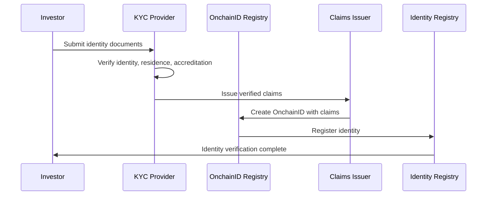
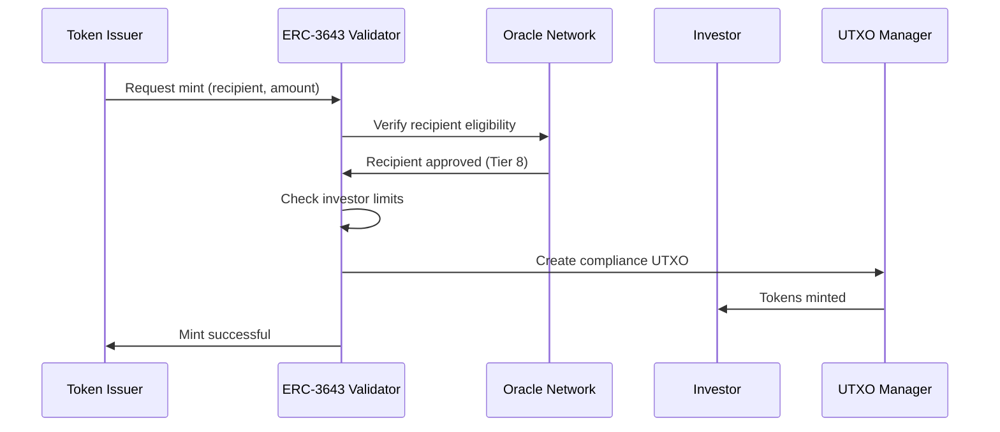
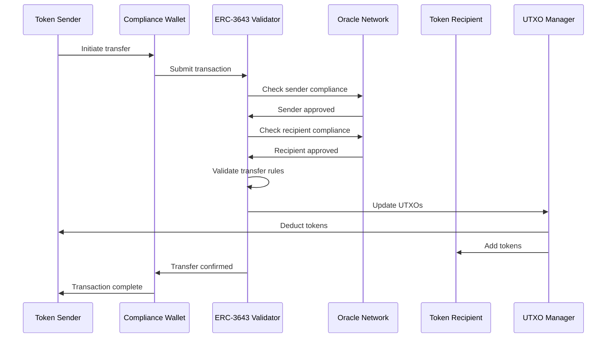
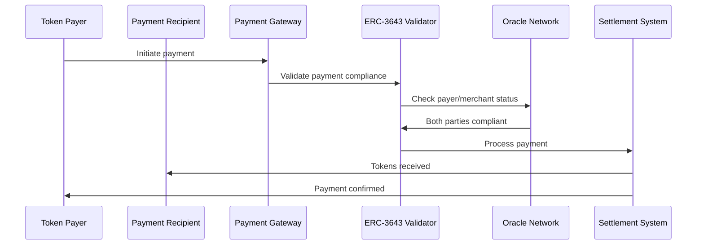
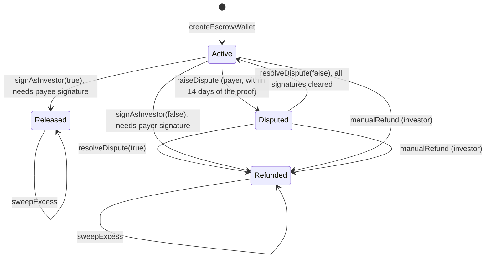
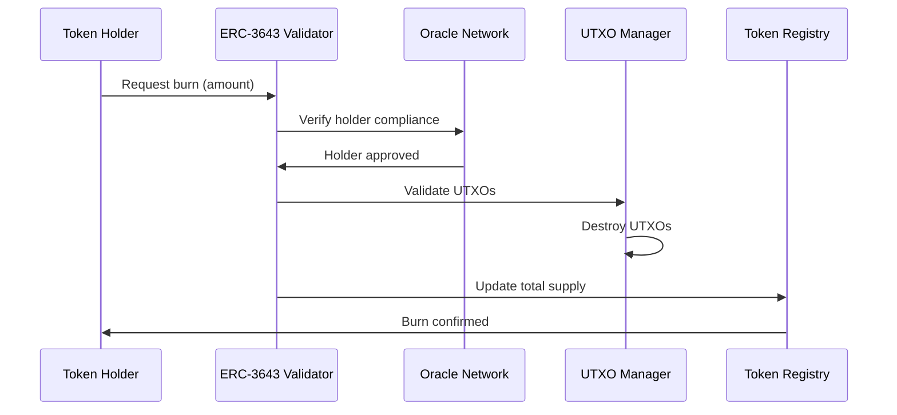
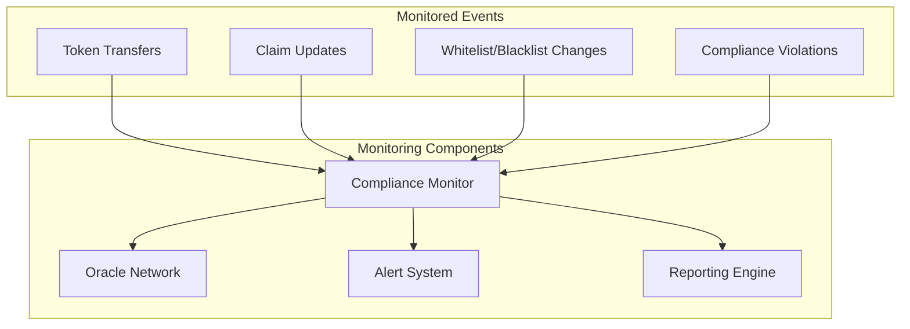

# Vanguard StableCoin - System Workflow Guide

## Overview

This document explains the complete system workflow for users to interact with the Vanguard StableCoin (VSC) system. The system provides 11 core workflows: **User Onboarding**, **Token Minting**, **Token Transfer**, **Oracle Access Control**, **Privacy & ZK Verification**, **Token Burning**, **Investor Type Management**, **Governance**, **Enhanced Escrow**, **Payment Protocol**, and **Complete System Integration**, all with comprehensive compliance validation through the interactive demo system (83 menu options).

## System Architecture

The system is built on a comprehensive smart contract architecture located in the `contracts/` directory:

```
contracts/
├── onchain_id/
│   ├── OnchainIDFactory.sol      # OnchainID factory contract
│   ├── OnchainID.sol             # Core OnchainID contract (ERC-735 claims)
│   ├── OnchainIDKeys.sol         # Its ERC-734 keys (abstract base)
│   ├── ClaimIssuer.sol           # Claim issuer contract
│   ├── KeyManager.sol            # Key rotation and recovery (timelocked)
│   └── interfaces/
│       ├── IERC734.sol           # ERC-734 interface
│       ├── IERC735.sol           # ERC-735 interface
│       └── IOnchainID.sol        # OnchainID interface
├── erc3643/
│   ├── Token.sol                 # Vanguard StableCoin token contract
│   ├── TokenMinting.sol          # Token minting system with limits
│   ├── TokenBurning.sol          # Token burning system
│   ├── IdentityRegistry.sol      # Identity registry contract
│   ├── ComplianceRegistry.sol    # Compliance registry contract
│   ├── TrustedIssuersRegistry.sol # Trusted issuers registry
│   ├── ClaimTopicsRegistry.sol   # Claim topics registry
│   └── interfaces/
│       ├── IERC3643.sol          # ERC-3643 interface
│       ├── IIdentityRegistry.sol # Identity registry interface
│       └── ICompliance.sol       # Compliance interface
├── oracle/
│   ├── OracleManager.sol         # Oracle management contract
│   ├── WhitelistOracle.sol       # Whitelist oracle contract
│   ├── BlacklistOracle.sol       # Blacklist oracle contract
│   ├── ConsensusOracle.sol       # OracleManager's weighted consensus engine (no owner)
│   └── interfaces/
│       ├── IOracle.sol           # Oracle interface
│       └── IOracleManager.sol    # Oracle manager interface
├── privacy/
│   ├── PrivacyManager.sol        # Privacy management contract
│   └── interfaces/
│       └── IZKVerifier.sol       # ZK verifier interface
├── test/
│   ├── mocks/
│   │   ├── MockOnchainID.sol     # Mock OnchainID for testing
│   │   ├── MockOracle.sol        # Mock oracle for testing
│   │   └── MockERC3643.sol       # Mock ERC-3643 for testing
│   └── helpers/
│       ├── TestHelpers.sol       # Test helper functions
│       └── DeploymentHelpers.sol # Deployment helper functions
├── hardhat.config.js
├── package.json
└── README.md
```

All user workflows interact with these smart contracts through the Rust backend, which provides additional validation, caching, and off-chain compliance management.

### Architecture Overview

For the complete system architecture and high-level workflow diagrams, see the [Design Document](.kiro/specs/cmta-utxo-poc/design.md) which provides:

- **High-Level System Workflow**: Overall transaction validation flow
- **Component Architecture**: Detailed system component interactions
- **Integration Patterns**: OnchainID and ERC-3643 integration architecture
- **Oracle Network Design**: Oracle consensus and list management
- **Privacy Layer Design**: Zero-knowledge proof integration

## Supported Workflows

The system supports the following core workflows, each with comprehensive compliance validation:

| Workflow | Description | Key Components |
|----------|-------------|----------------|
| **User Onboarding** | KYC/AML verification and OnchainID creation | OnchainID Factory, Claims Issuer, Identity Registry |
| **Token Minting** | Authorized token creation with compliance validation | ERC-3643 Token, Compliance Validator, Oracle Network |
| **Token Transfer** | Peer-to-peer transfers with UTXO compliance | UTXO Compliance, Transfer Restrictions, Oracle Consensus |
| **Privacy & ZK Verification** | A ZK allow list on VSC: a wallet binds itself with a whitelist proof, ComplianceRules reads the binding | ZKVerifierIntegrated, PrivacyManager, ComplianceRules (whitelist mode) |
| **Token Payment** | Payment processing with atomic transfers | Payment Processor, Compliance Validator, Event Reporter |
| **Escrow Payment** | Conditional payment held in a one-time escrow, settled 2-of-3 with an explicit direction | EscrowWalletFactory, MultiSigEscrowWallet, ComplianceRules (trusted contracts) |
| **Token Burning** | Authorized token destruction and compliance tracking | Token Contract, UTXO Store, Regulatory Reporter |

## Table of Contents

1. [User Onboarding Process](#user-onboarding-process)
2. [Token Minting Workflow](#token-minting-workflow)
3. [Token Transfer Workflow](#token-transfer-workflow)
4. [Privacy & ZK Verification Workflow](#privacy--zk-verification-workflow)
5. [Token Payment Workflow](#token-payment-workflow)
6. [Investor custody (2-of-2 MultiSigWallet)](#investor-custody-2-of-2-multisigwallet)
7. [Escrow Payment Workflow](#escrow-payment-workflow)
8. [Token Burning Workflow](#token-burning-workflow)
9. [Compliance Monitoring](#compliance-monitoring)
10. [Error Handling](#error-handling)

---

## User Onboarding Process

### Phase 1: Identity Verification


```mermaid
sequenceDiagram
    participant User as Investor
    participant KYC as KYC Provider
    participant OnchainID as OnchainID Registry
    participant Claims as Claims Issuer
    participant Identity as Identity Registry

    User->>KYC: Submit identity documents
    KYC->>KYC: Verify identity, residence, accreditation
    KYC->>Claims: Issue verified claims
    Claims->>OnchainID: Create OnchainID with claims
    OnchainID->>Identity: Register identity
    Identity->>User: Identity verification complete
```

#### Step 1: KYC/AML Verification
- **Required Documents**: 
  - Government-issued ID (passport, driver's license)
  - Proof of address (utility bill, bank statement)
  - Accreditation documents (for accredited investors)
  - Source of funds documentation
- **Verification Process**: 
  - Identity verification (name, date of birth, address)
  - AML screening against sanctions lists
  - Accreditation status verification
  - Country eligibility check

#### Step 2: OnchainID Creation and Smart Contract Registration
```javascript
// Smart contract interaction for OnchainID creation
const onchainIDFactory = await ethers.getContractAt("OnchainIDFactory", FACTORY_ADDRESS);

// Create OnchainID for user
const tx = await onchainIDFactory.createIdentity(
    userAddress,
    ethers.utils.keccak256(ethers.utils.toUtf8Bytes("unique_salt"))
);
const receipt = await tx.wait();
const onchainIDAddress = receipt.events[0].args.identity;

// Register identity in ERC-3643 Identity Registry
const identityRegistry = await ethers.getContractAt("IdentityRegistry", IDENTITY_REGISTRY_ADDRESS);
await identityRegistry.registerIdentity(
    userAddress,
    onchainIDAddress,
    countryCode // e.g., 840 for US
);
```

#### Step 3: Claims Issuance
```javascript
// Issue KYC claim
const claimIssuer = await ethers.getContractAt("ClaimIssuer", CLAIM_ISSUER_ADDRESS);
const kycClaimTopic = 1;
const kycClaimData = ethers.utils.toUtf8Bytes("KYC_VERIFIED");

await claimIssuer.issueClaim(
    onchainIDAddress,
    kycClaimTopic,
    kycClaimData
);

// Issue accreditation claim (if applicable)
const accreditationClaimTopic = 5;
const accreditationData = ethers.utils.toUtf8Bytes("ACCREDITED_INVESTOR");

await claimIssuer.issueClaim(
    onchainIDAddress,
    accreditationClaimTopic,
    accreditationData
);
```

#### Step 2: OnchainID Creation
- **OnchainID Deployment**: 
  - KYC provider calls OnchainIDFactory to deploy new OnchainID contract
  - OnchainID implements ERC-734 (Key Management) and ERC-735 (Claim Holder)
  - User's wallet address added as management key
  - Deterministic address generation using CREATE2
- **Claims Issued**:
  - `IDENTITY_CLAIM` (Topic 1): Verified identity information
  - `RESIDENCE_CLAIM` (Topic 3): Country of residence
  - `ACCREDITATION_CLAIM` (Topic 5): Investor type and accreditation status
  - `KYC_CLAIM` (Topic 6): KYC verification status
  - `AML_CLAIM` (Topic 7): AML screening results
  - `INVESTOR_TYPE_CLAIM` (Topic 8): Investor classification
- **Claim Verification**:
  - Each claim cryptographically signed by trusted issuer
  - Each ClaimIssuer keeps its claim and writes a copy to the OnchainID;
    the copy is a record, the identity checks no signatures
  - Required topics and trusted issuers are held by IdentityRegistry,
    whose `isVerified` asks each trusted issuer (`hasValidClaim`); the
    identity keeps no topic or issuer list of its own

#### Step 3: Identity Registry Registration
- OnchainID address registered in ERC-3643 Identity Registry
- Claims verified by trusted issuers through ClaimIssuer contract
- Country and investor type extracted from OnchainID claims
- Identity verification status updated in registry

#### Identity key lifecycle (KeyManager)

`KeyManager` rotates and recovers the keys of an OnchainID behind
timelocks. It has no owner and no allowlist of its own. An identity opts in
with `OnchainID.authorizeManager(keyManager)`, which only the identity's
owner can send; while it is authorized, KeyManager may add and remove the
identity's keys. Every KeyManager write for an identity needs the caller
to hold a MANAGEMENT key on it (or, for recovery, to be one of its agents)
and the identity to have authorized KeyManager ("KeyManager: Identity has
not authorized KeyManager" otherwise).

`deauthorizeManager` pauses KeyManager for the identity; it does not
cancel. While withdrawn nothing executes and agents can neither open nor
approve candidates; `cancelKeyRotation` and `cancelKeyRecovery` work while
withdrawn and are how to stop an item. A rotation or recovery executes
only within `EXECUTION_WINDOW` (7 days) after its execution time; after
that it reverts ("execution window passed, re-initiate"), so an item
paused for longer cannot revive when the identity re-authorizes.

- **Rotation**: a MANAGEMENT key calls `initiateKeyRotation(identity,
  oldKey, newKey, purpose)`; after the timelock anyone calls
  `executeKeyRotation`, which adds the new key and revokes the old one. The
  timelock is 24 hours (`DEFAULT_TIMELOCK`) unless the identity's own
  MANAGEMENT key set another with `setCustomTimelock` (1 hour to 7 days;
  it applies to rotations initiated afterwards). A rotation whose initiator
  lost its MANAGEMENT key before execution does not run; any current
  MANAGEMENT key can `cancelKeyRotation`. The timelock binds only rotations
  through KeyManager: a MANAGEMENT key adds and removes keys at once
  (ERC-734), through `batchAddKeys`/`batchRemoveKeys` or `OnchainID.addKey`/
  `removeKey`, so the timelock gives the holder visibility, not a control
  against a compromised MANAGEMENT key. This is by design (Task 4.5,
  R-45-1): `executeKeyRotation` and `executeKeyRecovery` themselves call
  `addKey`, so a timelock inside `addKey` would either block them or tie
  the identity to one manager. A MANAGEMENT key can also cancel or re-seat
  KeyManager recovery. The defence against a rogue MANAGEMENT key is the
  owner: `owner()` always passes `onlyManagementKey`, so it can
  `removeKey` the rogue key, and it alone controls `authorizeManager`,
  `deauthorizeManager` and `transferOwnership`. Recovery restores a lost
  key; it does not evict a key that is still active.
- **Removal with the holder's consent**: `removeKey` is the management
  action (no consent; KeyManager batches and rotations use it, and it is
  the only path for a non-ECDSA key). `OnchainID.removeKeyWithProof(key,
  purpose, signature)` is still sent by a MANAGEMENT key but also needs
  the key's own address to have signed `getRemoveKeyMessage(key,
  purpose)` (identity, key, purpose and chain id; the returned digest is
  already EIP-191 prefixed, so the holder signs the inner keccak256 with
  `signMessage`). Demo options 5 -> 1 and 5a.
- **Recovery**: a MANAGEMENT key names up to ten distinct recovery agents
  and a threshold (`setupKeyRecovery`), while the holder still holds its
  key. An agent opens a candidate key (`initiateKeyRecovery`), agents
  approve it, and after 48 hours (`RECOVERY_TIMELOCK`) with enough
  approvals anyone executes it: the key is added as MANAGEMENT and
  recovery closes until the next setup. Agents at threshold need no
  further consent from the holder: the owner, a MANAGEMENT key or the
  candidate's initiator can cancel within those 48 hours, and otherwise
  the key is added. Recovery restores a MANAGEMENT key only, never
  `owner()` (ownership and `authorizeManager` stay with the owner
  address), and a thief holding a MANAGEMENT key can cancel or re-run the
  setup, so recovery covers a lost key, not a compromised one. Each
  candidate has its own approvals and timelock; an expired candidate can
  be re-opened, with its approvals reset.
- **Batch and multi-signature keys**: `batchAddKeys` and `batchRemoveKeys`
  write several keys in one call; `addMultiSigKey` records an N-of-M
  signer set that `signMultiSigOperation` and `checkMultiSigThreshold`
  count. The multi-signature record is bookkeeping: nothing in KeyManager
  executes on it.

A wallet recovered with `Token.recoveryAddress` votes only once it holds a
key on its OnchainID; KeyManager recovery is the designed path. The demo
exercises the lifecycle in options 12, 12a, 12b, 5 and 5a
(docs/TESTNET_DEMO.md, "Identity keys through KeyManager"); its resume
works within one demo session only.

### Phase 2: Oracle Whitelist Approval

```mermaid
sequenceDiagram
    participant Node1 as Node 1 (wallet 1)
    participant Node2 as Node 2 (wallet 2)
    participant Manager as OracleManager (the gate)
    participant Engine as ConsensusOracle (engine)
    participant Whitelist as WhitelistOracle

    Node1->>Manager: submitQuery(investor, WHITELIST)
    Manager->>Engine: openQuery: snapshot every registered node (300)
    Node1->>Manager: submitResponse(query, YES)
    Manager->>Engine: recordVote (100 of 300)
    Node2->>Manager: submitResponse(query, YES)
    Manager->>Engine: recordVote (200 of 300 meets 66%)
    Engine-->>Manager: resolved YES; the manager stamps resolvedAt
    Node1->>Whitelist: provideAttestation(investor, query, YES, signature)
    Whitelist->>Manager: getQueryBinding, getQueryResolution
    Whitelist->>Whitelist: add the investor (tier 3, the consensus default)
```

Plan v2 Task 4.4 (D11 a): OracleManager is the only vote entry and
ConsensusOracle the engine it delegates the weighted tally to. A paused
node cannot answer or attest but stays in the denominator, so pausing
never lowers the bar; the operator (ops) pauses, unpauses and
emergency-designates nodes; governance removes them and sets the
threshold by an OracleParameters vote. Demo options 33a, 34a and 35a run
this path without prompts (docs/TESTNET_DEMO.md, "Oracle nodes and
consensus").

#### Whitelist Tiers
- **Tier 1-3**: Retail investors (limited access)
- **Tier 4-6**: Professional investors
- **Tier 7-8**: Accredited investors
- **Tier 9-10**: Institutional investors

---

## Token Minting Workflow

### Authorized Minting Process


```mermaid
sequenceDiagram
    participant Issuer as Token Issuer
    participant Validator as ERC-3643 Validator
    participant Oracle as Oracle Network
    participant Recipient as Investor
    participant UTXO as UTXO Manager

    Issuer->>Validator: Request mint (recipient, amount)
    Validator->>Oracle: Verify recipient eligibility
    Oracle->>Validator: Recipient approved (Tier 8)
    Validator->>Validator: Check investor limits
    Validator->>UTXO: Create compliance UTXO
    UTXO->>Recipient: Tokens minted
    Validator->>Issuer: Mint successful
```

### Minting Requirements

#### For the Issuer:
- Must have `MINTER_ROLE` in the token contract
- Must specify valid recipient address
- Must not exceed total supply limits

#### For the Recipient:
- Must be KYC/AML verified
- Must be whitelisted by oracles
- Must be registered in identity registry
- Must not exceed investor count limits
- Country must be in allowed jurisdictions

### Minting Process Steps

1. **Issuer Initiates Mint**
   ```solidity
   function mint(address to, uint256 amount) external onlyRole(MINTER_ROLE) {
       require(canReceive(to, amount), "Recipient not compliant");
       _mint(to, amount);
   }
   ```

2. **Compliance Validation**
   - Verify recipient's OnchainID exists
   - Check required claims are present and valid
   - Verify oracle whitelist status
   - Check blacklist status
   - Validate country restrictions
   - Check investor count limits

3. **UTXO Creation**
   ```rust
   let compliance_utxo = ERC3643ComplianceUTXO {
       value: amount,
       token_address: token_contract,
       onchain_id: recipient_identity,
       whitelist_tier: 8,
       country_code: 840, // US
       investor_type: InvestorType::AccreditedInvestor,
       oracle_whitelist_status: OracleWhitelistStatus::Approved,
       // ... other fields
   };
   ```

4. **Event Emission**
   ```solidity
   emit Transfer(address(0), to, amount);
   emit ComplianceMint(to, amount, whitelistTier);
   ```

---

## Token Transfer Workflow

### Standard Transfer Process


```mermaid
sequenceDiagram
    participant Sender as Token Sender
    participant Wallet as Compliance Wallet
    participant Validator as ERC-3643 Validator
    participant Oracle as Oracle Network
    participant Recipient as Token Recipient
    participant UTXO as UTXO Manager

    Sender->>Wallet: Initiate transfer
    Wallet->>Validator: Submit transaction
    
    Validator->>Oracle: Check sender compliance
    Oracle->>Validator: Sender approved
    
    Validator->>Oracle: Check recipient compliance
    Oracle->>Validator: Recipient approved
    
    Validator->>Validator: Validate transfer rules
    Validator->>UTXO: Update UTXOs
    
    UTXO->>Sender: Deduct tokens
    UTXO->>Recipient: Add tokens
    
    Validator->>Wallet: Transfer confirmed
    Wallet->>Sender: Transaction complete
```

### Transfer Validation Checklist

#### Sender Validation:
- ✅ Identity verified and active
- ✅ Whitelisted by oracles
- ✅ Not blacklisted
- ✅ Sufficient token balance
- ✅ Within its investor-type transfer cap (InvestorTypeRegistry; there is no holding-period rule)
- ✅ Country allowed by the token's jurisdiction rule
- ✅ Claims still valid

#### Recipient Validation:
- ✅ Identity verified and active
- ✅ Whitelisted by oracles
- ✅ Not blacklisted
- ✅ Country allowed
- ✅ Within its investor-type holding cap (InvestorTypeRegistry)
- ✅ Investor count not exceeded

#### Transfer Rules:
- ✅ Transfer amount within limits
- ✅ No transfer restrictions active
- ✅ Transfer agent approval (if required)

### Transfer Process Steps

1. **User Interface**
   ```
   ┌─────────────────────────────────────┐
   │ Send CMTA Tokens                    │
   ├─────────────────────────────────────┤
   │ To Address: 0x742d35Cc6634C0532... │
   │ Amount: 1,000 CMTA                  │
   │ ⚠️  Validating compliance...        │
   │                                     │
   │ Sender Status: ✅ Verified          │
   │ Recipient Status: ⏳ Checking...    │
   └─────────────────────────────────────┘
   ```

2. **Real-time Validation**
   ```rust
   async fn validate_transfer(
       from: &Address,
       to: &Address,
       amount: u64,
   ) -> Result<ValidationResult> {
       // Check sender compliance
       let sender_status = oracle_network.verify_compliance(from).await?;
       if !sender_status.is_compliant() {
           return Err(ValidationError::SenderNotCompliant);
       }
       
       // Check recipient compliance
       let recipient_status = oracle_network.verify_compliance(to).await?;
       if !recipient_status.is_compliant() {
           return Err(ValidationError::RecipientNotCompliant);
       }
       
       // Validate transfer rules
       validate_transfer_rules(from, to, amount).await
   }
   ```

3. **UTXO Updates**
   - Spend sender's UTXOs
   - Create new UTXOs for recipient
   - Update compliance metadata
   - Record transaction in audit trail

---

## Privacy & ZK Verification Workflow

Demo option 1 deploys `ZKVerifierIntegrated` (real verification,
`testingMode` false) and `PrivacyManager`; option 21 points ComplianceRules
at the PrivacyManager for VSC with the whitelist mode left at OracleOnly
(off). Option 41 attaches the pair and initialises the proof generator;
there is no mock mode in the demo, mocks live only in the tests.

Each investor keeps a secret and hands the operator the commitment
`Poseidon(identity, secret)` (identity = its OnchainID address). The
operator (the owner before the handover, ops after it) publishes the root
of the commitments on PrivacyManager; the investor proves membership with
a PLONK proof bound to its own wallet and submits it, and
`hasValidWhitelistProof(wallet)` is what ComplianceRules reads.

Option 42 -> 1 runs this on the live token: (a) VSC switches to whitelist
mode Either, which with no whitelist oracle bound is an allow list of
bindings; (b) the bound wallet transfers VSC to another bound, verified
wallet; (c) a verified wallet without a binding is refused; (d) the
operator rotates the root without the sender's commitment and the
sender's transfer is refused; (e) the sender re-onboards with a new
secret, re-proves and re-binds, and the transfer succeeds again.

Option 42 -> 2 proves the bound wallet's identity is not on the
BlacklistOracle's list; a demonstration only, nothing on chain gates on it
(D2).

Jurisdiction, accreditation and compliance aggregation are issuer-signed
attestations (D31 a). A trusted issuer signs the investor's attributes
with an EdDSA Baby Jubjub key (`scripts/zk/attest.js`); the investor
proves the signature and PrivacyManager's policy (the allowed jurisdiction
mask, the minimum accreditation, the compliance minimum and weights)
without revealing the attributes, and binds the record with
`submitAttestationProof` (`scripts/zk/prove-attestation.js`). PrivacyManager
accepts only issuer keys it trusts for the circuit, the current policy and
the submitting wallet, and keeps one wallet per attestation per policy;
`validatePrivateJurisdiction`, `validatePrivateAccreditation`,
`validatePrivateCompliance` and `validateAllPrivateCompliance` read the
records under each user's preference flags. Options 42 -> 3, 4 and 5 run
this with the demo's issuer key; 44, 45 and 46 show the records. The
issuer keys and the policies are owner settings, PrivacyParameters votes
(type 11) after the handover. See `docs/TESTNET_DEMO.md` for the
command-line tools and the runbook rules.

The jurisdiction set for private proofs is ComplianceRules' rule for VSC,
the same one transfers enforce (Task 3.8): the allowed mask is the OR of
the bits of the registered ISO codes ComplianceRules (`VSC.compliance()`,
read on every use) admits for VSC.
PrivacyManager only assigns each ISO 3166-1 numeric code an append-only
bit (`registerJurisdictionCode`, at most 64; the issuer attests the bit,
`attest.js --country`); a code gets a bit before it can be attested.
Blocking a country in ComplianceRules is enough to stop it on the private
path, and any rule change for VSC lapses the jurisdiction records (rule
version) and frees the attestation for a re-proof, so restoring a rule
revives none. An attestation is signed for one chain and one
PrivacyManager; another deployment refuses it.

An attestation expires on the date the issuer signs into it (Task 3.10):
`attest.js --sign` requires `--valid-days` or `--valid-until`, the proof
publishes `validUntil`, PrivacyManager refuses the proof from that date on
(`AttestationExpired`) and caps the record's `expiresAt` at it, so a
record never outlives its attestation. Re-attestation renews: the issuer
signs a new attestation and the investor proves again. The demo signs for
one year.

---

## Token Payment Workflow

### Payment Processing


```mermaid
sequenceDiagram
    participant Payer as Token Payer
    participant Merchant as Payment Recipient
    participant Gateway as Payment Gateway
    participant Validator as ERC-3643 Validator
    participant Oracle as Oracle Network
    participant Settlement as Settlement System

    Payer->>Gateway: Initiate payment
    Gateway->>Validator: Validate payment compliance
    Validator->>Oracle: Check payer/merchant status
    Oracle->>Validator: Both parties compliant
    Validator->>Settlement: Process payment
    Settlement->>Merchant: Tokens received
    Settlement->>Payer: Payment confirmed
```

### Payment Types

#### 1. Direct Token Payment
- **Use Case**: Direct transfer for goods/services
- **Process**: Standard transfer with payment metadata
- **Compliance**: Both parties must be compliant

#### 2. Escrow Payment
- **Use Case**: Conditional payments with release conditions
- **Process**: Tokens held in a one-time `MultiSigEscrowWallet`; see [Escrow Payment Workflow](#escrow-payment-workflow)
- **Compliance**: Escrow contract must be a trusted contract on VSC in ComplianceRules (trust is per token)

#### 3. Recurring Payment
- **Use Case**: Subscription or installment payments
- **Process**: Pre-authorized recurring transfers
- **Compliance**: Ongoing compliance monitoring required

### Payment Validation

```rust
pub struct PaymentRequest {
    pub payer: Address,
    pub recipient: Address,
    pub amount: u64,
    pub payment_type: PaymentType,
    pub metadata: PaymentMetadata,
}

pub enum PaymentType {
    Direct,
    Escrow { release_conditions: Vec<Condition> },
    Recurring { frequency: Duration, total_payments: u32 },
}

async fn process_payment(request: PaymentRequest) -> Result<PaymentResult> {
    // Validate both parties
    validate_payment_compliance(&request.payer, &request.recipient).await?;
    
    // Check payment-specific rules
    match request.payment_type {
        PaymentType::Direct => process_direct_payment(request).await,
        PaymentType::Escrow { .. } => process_escrow_payment(request).await,
        PaymentType::Recurring { .. } => process_recurring_payment(request).await,
    }
}
```

---

## Investor custody (2-of-2 MultiSigWallet)

Plan v2 Task 4.3 (owner decision D13 = b). An investor-status request locks VSC in a contract custody wallet, not as a freeze in the user's own wallet.

| Step (demo option 23) | Who signs | On chain |
|---|---|---|
| 2. Request | User | `InvestorRequestManager.requestInvestorStatus(type)`: needs a verified, Normal holder; the lock amount comes from `lockRequirements` |
| 4. Create wallet | Bank (ops, wallet 10) | `createMultiSigWallet(user)` deploys `MultiSigWallet(bank, user, VSC)`; the manager, a ComplianceRules registrar for the `MultiSigWallet` code hash, trusts it on VSC in the same call; the address is read back from `requests(user)` |
| 5. Lock | User | `approve(wallet, amount)`, `MultiSigWallet.lockTokens(amount)` (the tokens move into the wallet), `confirmTokensLocked()` |
| 6. Approve | Bank | `approveRequest(user)`: the manager, a compliance officer, assigns the type while the lock is held |
| 8. Downgrade | User, then bank | `proposeUnlock(amount, recipient, reason)`, `signUnlock` by both; the second signature pays out. Then a compliance officer sets the type back to Normal |

Neither signer can move the tokens alone, and every payout passes the token's gate on the recipient (identity, country, caps). The wallet may also hold escrow investor fees routed to it (option 62); an unlock pays from that free balance first, then from the lock. The demo sets the lock requirements within the Normal type's one-transfer cap (2,000 / 4,000 / 8,000 VSC for Retail / Accredited / Institutional), because the user is still Normal when locking; the contract defaults (10,000 / 100,000 / 1,000,000) exceed the default Normal caps. A platform contract holds client tokens here: the bank alone cannot move them, but it is contract custody.

## Escrow Payment Workflow

A conditional VSC payment between a **payer** and a **payee**, mediated by a registered **investor**. Each payment gets its own `MultiSigEscrowWallet`, deployed by `EscrowWalletFactory` and used exactly once. Demo options 61 to 73b.

### Parties and money

| Party | Does | Must be |
|-------|------|---------|
| Payer | Funds the escrow. May dispute. Signs to allow a refund. | KYC/AML verified. May be unknown at creation (marketplace): the first verified funder becomes the payer. |
| Payee | Ships, submits the signed shipment proof, signs to allow a release. | KYC/AML verified. |
| Investor | Creates the escrow, states the settlement direction, mediates disputes, may refund. | Registered on the factory (`registerInvestor`, `INVESTOR_ROLE`). |
| Platform | Receives the owner fee. | Fee wallet set on the factory. |

The escrow holds **amount + 3% investor fee + 2% owner fee**, all fixed at creation. A 1000 VSC payment is funded with 1050 VSC. On release the payee gets 1000, the investor fee wallet 30, the platform fee wallet 20. On refund the payer gets the full 1050 back.

The escrow wallet becomes a trusted contract on VSC in the same transaction that creates it: `EscrowWalletFactory` is a ComplianceRules **registrar** on VSC (Task 4.3) and calls `addTrustedContract(VSC, wallet)` itself. The ComplianceRules owner (governance after the handover) names registrars with `setTrustedRegistrar(token, registrar, walletCodeHash)`; a registrar may trust only an account whose runtime code hash equals the registered one (the compiled `MultiSigEscrowWallet`, which keeps its parameters in storage so every escrow has that hash), and only the owner may remove trust. Ops and rule administrators have no trust power. A factory that is not a registrar cannot create escrows: the demo names it at option 61 (a ComplianceRules vote after the handover). Trust is per token since Task 4.1: an escrow trusted on VSC is not trusted on VGT, and governance, trusted on VGT to hold proposal fees, is not trusted on VSC. That is what lets VSC move in and out of a contract that has no identity of its own. Only addresses with code can be trusted: never a wallet, and never a wallet carrying an EIP-7702 delegation (the setter rejects the `0xef0100` indicator). The payer and payee are verified investors, and the other party to every transfer is still checked.

### Lifecycle


```mermaid
stateDiagram-v2
    [*] --> Active : createEscrowWallet
    Active --> Disputed : raiseDispute (payer, within 14 days of the proof)
    Disputed --> Active : resolveDispute(false), all signatures cleared
    Disputed --> Refunded : resolveDispute(true)
    Active --> Released : signAsInvestor(true), needs payee signature
    Active --> Refunded : signAsInvestor(false), needs payer signature
    Active --> Refunded : manualRefund (investor)
    Disputed --> Refunded : manualRefund (investor)
    Released --> Released : sweepExcess
    Refunded --> Refunded : sweepExcess
```

`Active`, `Released`, `Refunded`, `Disputed` are the on-chain states. Funding, the shipment proof, and the payer and payee signatures all happen while the escrow is `Active` and do not change its state; whether it has been funded is a separate on-chain flag, `funded`.

### Steps

**1. Deploy the factory (61).** Needs the ERC-3643 token (21). The demo also onboards the platform fee wallet as a verified investor here.

**2. Register the investor (62).** The investor's fee wallet is set at registration. An investor onboarded through option 23 has a `MultiSigWallet` (see [Investor custody](#investor-custody-2-of-2-multisigwallet)); option 62 uses it as the fee wallet. It is a trusted contract on VSC, not an identity, so it neither counts in the governance electorate nor needs a cap exemption, and fees paid to it leave only with the bank's and the user's signatures. A user created through option 24 has no wallet; the demo falls back to a reserved signer, onboarded as a verified identity. A keyless placeholder fee address left by a pre-4.3 run is retired: a registry agent deletes its identity and the investor is re-registered with the real wallet. Each release adds the investor fee to the factory's `totalFeesEarned` for that investor (option 69 prints it).

**3. Create the escrow (63).** The investor names the payer (or "Unknown" for a marketplace escrow), the payee, and the amount. The factory checks both known parties are verified, deploys the wallet, and emits `EscrowWalletCreated` with the payment id and wallet address.

**4. Fund it (64).** The payer approves the factory for the total and calls `fundEscrowWallet(paymentId)`. The factory pulls the tokens in and then marks the wallet `funded`. **Funding is once only**: a second call reverts `EscrowAlreadyFunded`. The demo checks the flag before asking for the approval, so no gas is spent on a doomed attempt.

**5. Ship and prove (65).** The payee submits the shipment data, its hash, and a signature. The contract recovers the signer from a digest that binds the string `VanguardShipmentProof`, **this escrow's address**, **the chain id**, and the hash, and requires it to be the payee. A signature copied from another escrow or another chain is rejected with `ProofNotSignedByPayee`. Submission starts the **14-day dispute window**.

**6. Dispute window.** While it is open the payer may `raiseDispute` (66) and the payee cannot sign. The investor resolves (67): refund the payer, or reopen the escrow. Reopening clears **all three** signatures, so nothing signed before the dispute carries over. On a local node use 73b to jump past the window; on a real network it closes on its own.

**7. Settle, 2-of-3 with an explicit direction.** The payee signs (68) once the window has closed; the payer may sign at any time while the escrow is active. Neither signature moves funds. The investor then signs (69) and **states the direction**:

| Investor says | Requires | Result |
|---------------|----------|--------|
| release | payee has signed | amount to payee, fees to the two fee wallets, state `Released` |
| refund | payer has signed | full total back to the payer, state `Refunded` |

If the required counterparty signature is missing the call reverts (`PayeeHasNotSigned` / `PayerHasNotSigned`). The direction is never inferred from who signed first; that inference used to let a payer pre-sign and turn an intended release into a refund to themselves.

The escrow wallet is a trusted contract, but the human side of every escrow leg still meets its investor-type caps (D26): funding counts against the payer's transfer cap, and a release that would put the payee over its holding cap reverts with `Holding limit exceeded`. The same holds for every recipient of a settlement: a release or refund that would put the payee, the payer or either fee wallet over its holding cap reverts atomically, the escrow stays `Active` (or `Disputed`) and the funds stay in it. The exits are: the over-cap party moves balance out, the registry raises its investor type, or it is exempted (D22). The refund (which needs the payer's signature or a dispute) stays open only while the payer has room under its own holding cap. Option 69 checks every leg before signing and names the one that would fail. The two fee wallets carry the D22 exemption so fees never hit their holding cap: the deploy sets it before the handover (the demo does it in options 61 and 62), after it an InvestorTypeConfig vote (option 76, type 0, choice 2). The handover check warns about any fee wallet (the factory's owner wallet, each registered investor's fee wallet, and a `feeWallets` list in handover.json) that is not exempt on the registry the Token enforces, and about a fee wallet registered after the handover. The factory itself is Ownable2Step and goes to governance at the ceremony: its owner (governance, written into every new escrow) sets the fee wallet, the registry and the rules by an EscrowFactoryParameters vote (type 9), while ops holds ADMIN_ROLE to register and deactivate investors. The OnchainIDFactory follows the same path under IdentityFactoryParameters (type 10). After a wallet recovery, re-assign the investor type (and the exemption, if any) to the new wallet: recovery moves the balance but not the type, so the new wallet holds the old balance as a Normal investor and cannot receive until its type is assigned.

**8. Manual refund (70).** The investor may refund the payer at any time while the escrow is `Active` or `Disputed`, without any other signature.

**9. Sweep what settlement left behind (70a).** See below.

### Why an escrow can hold more than it pays out, and what to do

Release and refund pay **fixed** sums. Anything else that reaches the escrow address is not part of the settlement and stays there:

| How tokens arrive | Stopped? | What happens |
|-------------------|----------|--------------|
| `fundEscrowWallet` through the factory | Yes, once only (`funded`) | Second call reverts. |
| A plain `transfer(escrowAddress, x)` by any verified holder | No. The factory never sees it. | Lands in the escrow. Settlement ignores it. |

Once the escrow is `Released` or `Refunded`, an escrow party (payer, payee, investor or the platform owner) may call `sweepExcess()`; anyone else gets `NotEscrowParty`. It sends the entire remaining VSC balance to the payer, the party who funds escrows and the only one who plausibly paid twice. If no payer was ever set (a marketplace escrow settled purely from direct transfers) it goes to the platform fee wallet instead, never to the zero address. It reverts while the escrow is still active (`EscrowStillActive`) and when there is nothing to sweep (`NothingToSweep`). It only ever touches the one token the escrow was created for, and the recipient's holding cap applies to the sweep like any other transfer.

Escrows deployed from earlier bytecode do not have this function. Tokens stranded in one of those need a separate recovery decision.

### A demo run that shows the whole thing

On a local node, this order works from a fresh start:

```
1 → 21 → 51 → 22 → 25/1/1          deploy, mint to the central bank
24/1 Alice, 24/1 Bob               payer and payee
23/1 Ivan, then 23/2 … 23/6 for Ivan   investor with a placeholder fee address (Task 4.3)
61 → 62 (Ivan) → 63 (Ivan, Alice → Bob, 1000)
64                                  fund: escrow holds 1050
   (send another 1050 straight to the escrow address, outside the factory)
65 → 73b → 68 → 69/1                proof, close the window, payee signs, investor releases
71                                  Released, escrow still holds 1050
70a                                 "Stranded tokens returned … To: <Alice> Amount: 1050.0"
71                                  escrow holds 0
```

Option 71 shows the on-chain state and every party's balance; 71a shows all balances at once.

---

## Token Burning Workflow

### Authorized Burning Process


```mermaid
sequenceDiagram
    participant Holder as Token Holder
    participant Validator as ERC-3643 Validator
    participant Oracle as Oracle Network
    participant UTXO as UTXO Manager
    participant Registry as Token Registry

    Holder->>Validator: Request burn (amount)
    Validator->>Oracle: Verify holder compliance
    Oracle->>Validator: Holder approved
    Validator->>UTXO: Validate UTXOs
    UTXO->>UTXO: Destroy UTXOs
    Validator->>Registry: Update total supply
    Registry->>Holder: Burn confirmed
```

### Burning Requirements

#### For Token Holders:
- Must own sufficient tokens
- Must be compliant (not blacklisted)
- Must satisfy any lock-up periods
- May require transfer agent approval

#### For the System:
- Must update total supply
- Must destroy corresponding UTXOs
- Must maintain audit trail
- Must check for any restrictions

### Burning Process Steps

1. **Burn Request**
   ```solidity
   function burn(uint256 amount) external {
       require(balanceOf(msg.sender) >= amount, "Insufficient balance");
       require(canBurn(msg.sender, amount), "Burn not allowed");
       _burn(msg.sender, amount);
   }
   ```

2. **Compliance Validation**
   ```rust
   async fn validate_burn(
       holder: &Address,
       amount: u64,
   ) -> Result<BurnValidation> {
       // Check holder is not blacklisted
       let blacklist_status = oracle_network.check_blacklist(holder).await?;
       if blacklist_status.is_blacklisted() {
           return Err(BurnError::HolderBlacklisted);
       }
       
       // Check lock-up periods
       let lockup_status = check_lockup_periods(holder, amount).await?;
       if !lockup_status.can_burn() {
           return Err(BurnError::TokensLocked);
       }
       
       Ok(BurnValidation::Approved)
   }
   ```

3. **UTXO Destruction**
   - Select UTXOs to burn
   - Validate UTXO ownership
   - Destroy selected UTXOs
   - Update holder's balance

---

## Compliance Monitoring

### Continuous Monitoring System


```mermaid
graph TB
    subgraph "Monitoring Components"
        Monitor[Compliance Monitor]
        Oracle[Oracle Network]
        Alerts[Alert System]
        Reports[Reporting Engine]
    end
    
    subgraph "Monitored Events"
        Transfers[Token Transfers]
        Claims[Claim Updates]
        Lists[Whitelist/Blacklist Changes]
        Violations[Compliance Violations]
    end
    
    Monitor --> Oracle
    Monitor --> Alerts
    Monitor --> Reports
    
    Transfers --> Monitor
    Claims --> Monitor
    Lists --> Monitor
    Violations --> Monitor
```

### Monitoring Activities

#### 1. Real-time Compliance Checks
- **Identity Status**: Monitor OnchainID validity
- **Claims Expiry**: Track claim expiration dates
- **Oracle Lists**: Monitor whitelist/blacklist changes
- **Regulatory Updates**: Track regulatory requirement changes

#### 2. Automated Alerts
- **Compliance Violations**: Immediate alerts for violations
- **Claim Expiry**: Warnings before claims expire
- **Suspicious Activity**: Unusual transaction patterns
- **Regulatory Changes**: Updates to compliance requirements

#### 3. Periodic Reviews
- **Quarterly Reviews**: Comprehensive compliance assessment
- **Annual Audits**: Full system compliance audit
- **Regulatory Reporting**: Automated regulatory reports
- **Performance Metrics**: System performance analysis

---

## Error Handling

### Common Error Scenarios

#### 1. Identity Verification Errors
```
❌ Identity Verification Failed
Error Code: ID_001
Reason: OnchainID not found in registry
Resolution: Complete identity verification process
Estimated Time: 2-5 business days
```

#### 2. Compliance Validation Errors
```
❌ Transfer Rejected
Error Code: COMP_003
Reason: Recipient not whitelisted
Details: 
- Recipient address: 0x742d35Cc...
- Required whitelist tier: 5
- Current status: Not whitelisted
Resolution: Recipient must complete oracle whitelist approval
```

#### 3. Oracle Consensus Errors
```
❌ Oracle Consensus Failed
Error Code: ORC_002
Reason: Insufficient oracle responses
Details:
- Required consensus: 3 of 5 oracles
- Received responses: 2 of 5 oracles
- Failed oracles: Oracle-3, Oracle-5
Resolution: Retry transaction or wait for oracle recovery
```

#### 4. Regulatory Compliance Errors
```
❌ Regulatory Violation
Error Code: REG_005
Reason: Country restriction violation
Details:
- Sender country: United States
- Recipient country: Restricted Territory
- Applicable regulation: OFAC Sanctions
Resolution: Transfer not permitted under current regulations
```

### Error Recovery Process

1. **Automatic Retry**: System automatically retries failed operations
2. **Fallback Mechanisms**: Use cached data when oracles unavailable
3. **Manual Review**: Complex cases escalated to compliance team
4. **User Notification**: Clear error messages with resolution steps

---

## System Status Dashboard

### User Dashboard Example
```
┌─────────────────────────────────────────────────────────┐
│ CMTA Token Compliance Dashboard                         │
├─────────────────────────────────────────────────────────┤
│ Account Status: ✅ Fully Compliant                     │
│ Whitelist Tier: 8 (Accredited Investor)                │
│ Token Balance: 25,000 CMTA                             │
│ Available for Transfer: 25,000 CMTA                    │
├─────────────────────────────────────────────────────────┤
│ Compliance Status:                                      │
│ • Identity Verified: ✅ Valid until 2025-12-31        │
│ • KYC Status: ✅ Current                               │
│ • AML Screening: ✅ Clear                              │
│ • Accreditation: ✅ Valid until 2025-06-30            │
│ • Oracle Whitelist: ✅ Tier 8                         │
│ • Blacklist Status: ✅ Clear                          │
├─────────────────────────────────────────────────────────┤
│ Recent Activity:                                        │
│ • 2024-01-15: Received 5,000 CMTA from 0x123...       │
│ • 2024-01-10: Sent 2,000 CMTA to 0x456...             │
│ • 2024-01-05: Compliance review completed              │
├─────────────────────────────────────────────────────────┤
│ Actions:                                                │
│ [Send Tokens] [Request Payment] [View History]         │
└─────────────────────────────────────────────────────────┘
```

This comprehensive workflow ensures that all token operations (mint, burn, transfer, payment) maintain full regulatory compliance while providing a smooth user experience for qualified investors.